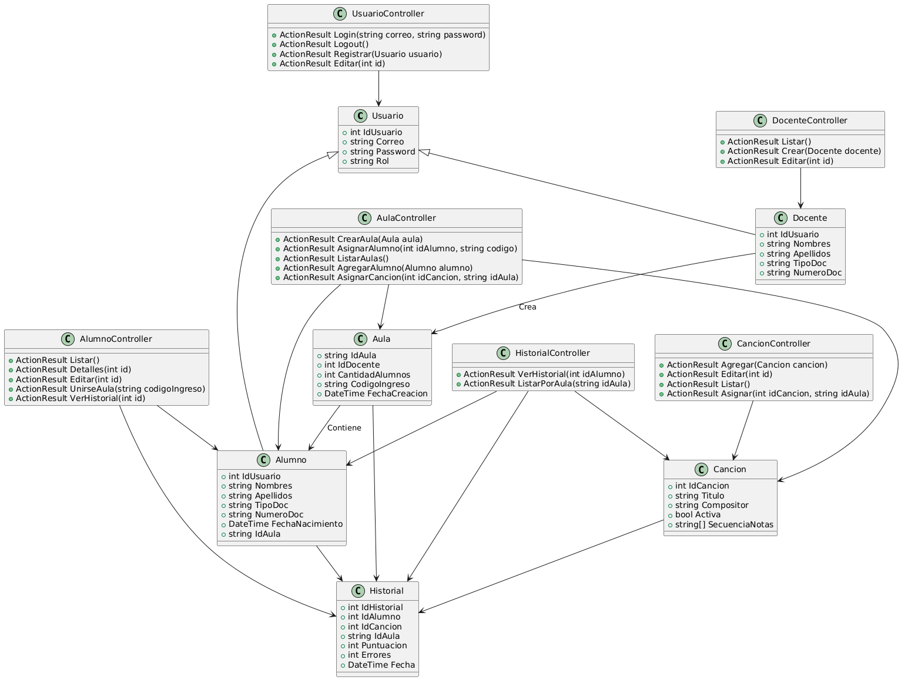

<!-- Intro -->
# PianoRise
 

### Curso  
Patrones de Software

### Integrantes
- **Agreda Ramirez, Jesús Eduardo** — (2021069823)  
- **Contreras Lipa, Alvaro Javier** — (2021070020)  
- **Ortiz Fernandez, Ximena Andrea** — (2021071080)

---

## 🧾 Descripción del Sistema

PianoRise es una plataforma web interactiva diseñada para facilitar el aprendizaje autónomo del piano a través de reconocimiento de notas musicales, creación de aulas virtuales y monitoreo por parte de los docentes.

- Reconocimiento de notas
- Gestión de alumnos, docentes y repertorios
- Progreso trazable por historial y reportes

---

## 🗃️ Diagrama de Base de Datos

Representación de las entidades principales y sus relaciones.

---

## 🧱 Diagrama de Clases

Estructura de clases y relaciones en el sistema orientado a objetos.

---

## 🧩 Diagrama de Componentes

Componentes clave del sistema y sus interacciones lógicas.

---

## 🚀 Diagrama de Despliegue

Representación física del sistema en el entorno de producción.

