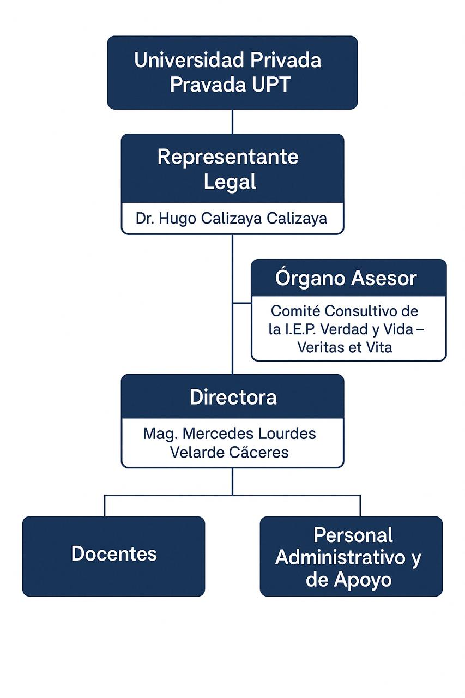

[comment]: 

**UNIVERSIDAD PRIVADA DE TACNA**

**FACULTAD DE INGENIERÍA**

**Escuela Profesional de Ingeniería de Sistemas**

**Plataforma Web Interactiva para el Aprendizaje Autónomo del Piano con Reconocimiento de Notas en Tiempo Real \- PianoRise**

Curso: Patrones de Software

Docente: *Mag. Patrick Cuadros Quiroga*

Integrantes:

 ***Agreda Ramirez, Jesús Eduardo 	(2021069823)***  
***Contreras Lipa, Alvaro Javier    (2021070020)***  
***Ortiz Fernandez, Ximena Andrea 	(2021071080)***

**Tacna – Perú**  
**2025**

---

**Plataforma Web Interactiva para el Aprendizaje Autónomo del Piano con Reconocimiento de Notas en Tiempo Real \- PianoRise**

**Documento de Especificación de Requerimientos de Software**

**Versión *1.0***

| CONTROL DE VERSIONES |  |  |  |  |  |
| :---: | :---: | :---: | :---: | :---: | ----- |
| Versión | Hecha por | Revisada por | Aprobada por | Fecha | Motivo |
| 1.0 |  |  |  | 29/03/2025 | Versión Original |
| 2.0 |  |  |  | 10/06/2025 | Version 2.0      |

---
**ÍNDICE GENERAL**

[Introducción](#introducción)

[I. Generalidades de la Empresa](#generalidades-de-la-empresa)

[1\. Nombre de la Empresa](#nombre-de-la-empresa)

[2\. Visión](#visión)

[3\. Misión](#misión)

[4\. Organigrama](#organigrama)

[II. Visionamiento de la Empresa](#visionamiento-de-la-empresa)

[1\. Descripción del Problema](#descripción-del-problema)

[2\. Objetivos de Negocios](#objetivos-de-negocios)

[3\. Objetivos de Diseño](#objetivos-de-diseño)

[4\. Alcance del proyecto](#alcance-del-proyecto)

[5\. Viabilidad del sistema](#viabilidad-del-sistema)

[6\. Información obtenida del Levantamiento de Información](#información-obtenida-del-levantamiento-de-información)

[III. Análisis de Procesos](#análisis-de-procesos)

[a) Diagrama del Proceso Actual \- Diagrama de actividades](#diagrama-del-proceso-actual---diagrama-de-actividades)

[b) Diagrama del Proceso Propuesto \- Diagrama de actividades Inicial](#diagrama-del-proceso-propuesto---diagrama-de-actividades-inicial)

[IV. Especificación de Requerimientos de Software](#especificación-de-requerimientos-de-software)

[a) Cuadro de Requerimientos Funcionales Inicial](#cuadro-de-requerimientos-funcionales-inicial)

[b) Cuadro de Requerimientos No Funcionales](#cuadro-de-requerimientos-no-funcionales)

[c) Cuadro de Requerimientos Funcionales Final](#cuadro-de-requerimientos-funcionales-inicial)

[d) Reglas de Negocio](#reglas-de-negocio)

[V. Fases de Desarrollo](#fases-de-desarrollo)

[1\. Perfiles de Usuario](#perfiles-de-usuario)

[2\. Modelo Conceptual](#modelo-conceptual)

[a) Diagrama de Paquetes](#diagrama-de-paquetes)

[b) Diagrama de Casos de Uso](#diagrama-de-casos-de-uso)

[c) Escenarios de Caso de Uso (Narrativa)](#escenarios-de-caso-de-uso-\(narrativa\))

[3\. Modelo Lógico](#modelo-lógico)

[a) Análisis de Objetos](#análisis-de-objetos)

[b) Diagrama de Actividades con Objetos](#diagrama-de-actividades-con-objetos)

[c) Diagrama Secuencia](#diagrama-secuencia)

[d) Diagrama de Clases](#diagrama-de-clases-\(link-a-diagrama-de-clases\))

[Conclusiones](#conclusiones)

[Recomendaciones](#recomendaciones)

---

## **Documento de Especificación de Requerimientos de Software**

### **Introducción** {#introducción}

El presente documento de Especificación de Requerimientos de Software (SRS) describe los requisitos funcionales y no funcionales para el desarrollo de la plataforma PianoRise, una aplicación web interactiva diseñada para facilitar el aprendizaje autónomo del piano, especialmente para estudiantes principiantes. Esta plataforma surge como una solución educativa innovadora ante los desafíos que enfrentan quienes desean aprender piano sin acceso a instrucción presencial o métodos interactivos eficaces.

En respuesta a la necesidad de ofrecer una herramienta accesible, práctica y motivadora, PianoRise busca establecer un nuevo estándar en la enseñanza digital del piano. Mediante una interfaz intuitiva y un sistema de reconocimiento de audio, la plataforma permitirá a los usuarios visualizar en pantalla las notas a tocar, recibir retroalimentación inmediata y monitorear su avance.

Además, PianoRise se compromete a brindar una experiencia didáctica centrada en la práctica, ofreciendo un repertorio de canciones básicas, ejercicios progresivos y una estructura de aprendizaje flexible. Todo ello se desarrollará bajo tecnologías web modernas, permitiendo el acceso desde navegadores sin necesidad de instalación adicional.

Este documento establece los objetivos funcionales y técnicos del sistema, así como el alcance del proyecto, incluyendo las funcionalidades que serán implementadas en esta primera versión y las limitaciones correspondientes. Su propósito es servir como guía para el diseño, desarrollo, validación y mantenimiento de la plataforma PianoRise.

---

1. #### **Generalidades de la Empresa** {#generalidades-de-la-empresa}

   1. ##### **Nombre de la Empresa** {#nombre-de-la-empresa}

      Institución Educativa Privada Verdad y Vida – Veritas et Vita.

   2. ##### **Visión** {#visión}

      Ser una institución educativa líder en la formación integral de estudiantes, promoviendo valores éticos, responsabilidad social y excelencia académica, contribuyendo al desarrollo sostenible de la sociedad.

   3. ##### **Misión** {#misión}

      Brindar una educación de calidad que fomente el desarrollo de competencias académicas, personales y sociales en los estudiantes, mediante una enseñanza innovadora y comprometida con los valores institucionales.​​

   4. ##### **Organigrama** {#organigrama}

     
   
   **Gráfico 01\.** Organigrama  de la Institución Educativa Privada Verdad y Vida.
   ***Fuente:** Elaboración propia.*

---

2. #### Visionamiento de la Empresa

   1. ##### **Descripción del Problema** {#descripción-del-problema}

      Actualmente, en el entorno de enseñanza musical, los procesos de gestión y seguimiento de las clases de piano presentan importantes limitaciones debido a la falta de herramientas tecnológicas especializadas. El manejo de aulas, el seguimiento del progreso de los estudiantes y la organización del repertorio musical se realizan de manera manual o utilizando plataformas no adaptadas a las necesidades específicas de la formación instrumental. Esta situación genera ineficiencias, dificulta la evaluación objetiva del desempeño y limita el crecimiento académico de los estudiantes. Los principales problemas identificados son:

      - **Procesos manuales e ineficientes**: La creación y gestión de clases, así como el seguimiento del progreso de los alumnos, se realiza de forma manual o con herramientas genéricas, lo que provoca demoras, errores y sobrecarga de trabajo para los docentes.
      - **Falta de seguimiento estructurado del desempeño estudiantil**: Actualmente, no se dispone de un sistema que registre de manera organizada las canciones practicadas, los errores cometidos y los logros alcanzados por los estudiantes, dificultando así una evaluación continua y objetiva.
      - **Ausencia de un módulo especializado para repertorios musicales**: No existe un sistema que permita seleccionar y administrar repertorios adaptados al nivel de cada aula, limitando la personalización de la enseñanza y el desarrollo musical de los estudiantes.
      - **Gestión desorganizada de información**: El registro de alumnos, aulas y progreso de aprendizaje se realiza de forma dispersa, aumentando el riesgo de pérdida de datos importantes y dificultando la obtención de reportes consolidados.
      - **Limitada visibilidad para los docentes sobre el avance de sus estudiantes**: Los docentes carecen de herramientas que les permitan monitorear de forma clara y detallada el desempeño de cada alumno, lo que dificulta identificar áreas de mejora y establecer estrategias de refuerzo.
      - **Falta de mecanismos para generar reportes de desempeño**: No se dispone de un sistema automatizado que permita generar reportes gráficos o métricos sobre el progreso individual y grupal, lo que restringe la capacidad de análisis y retroalimentación educativa.
   2. ##### **Objetivos de Negocios** {#objetivos-de-negocios}
   - Proporcionar una solución tecnológica accesible para mejorar la enseñanza del piano a estudiantes principiantes.
   - Incrementar el interés de los estudiantes en la práctica diaria mediante una plataforma interactiva.
   - Asegurar la participación activa de los docentes al incorporar PianoRise como herramienta complementaria para la enseñanza presencial.
   - Facilitar el monitoreo del progreso de los estudiantes a través de una interfaz de administración para docentes, mejorando la eficiencia en el seguimiento y evaluación del rendimiento.

   3. ##### **Objetivos de Diseño** {#objetivos-de-diseño}
      El diseño del sistema busca cumplir con una serie de objetivos estratégicos y técnicos que garanticen una experiencia efectiva, funcional y sostenible tanto para los estudiantes como para los       docentes y administradores. Los principales objetivos de diseño considerados en el desarrollo de la plataforma:
      - Interfaz intuitiva y centrada en el usuario
      - Evaluación musical con retroalimentación inmediata
      - Seguimiento personalizado del progreso
      - Gestión del repertorio por aula
      - Reportes detallados de desempeño
      - Gestión de usuarios y control de acceso

   4. ##### **Alcance del proyecto** {#alcance-del-proyecto}

      1) Inclusiones
         - **Desarrollo de una Plataforma Web**: 
            - Creación de una plataforma web accesible desde navegadores (Chrome, Firefox, Edge), con una interfaz gráfica intuitiva y moderna.
         - **Funcionalidades Clave**:
            - **Gestión de usuarios**: 
               - Permitir el registro seguro de usuarios mediante la creación de credenciales de acceso.
               - Implementar el inicio de sesión y cierre de sesión de forma segura.
               - Permitir la edición de información personal por parte de los usuarios, y la gestión de cuentas docentes por parte del administrador.
            - **Reconocimiento de notas**:
               - Capturar y procesar el audio a través del micrófono del usuario.
               - Detectar las notas musicales tocadas y compararlas con las notas esperadas en cada ejercicio o canción.
               - Proporcionar retroalimentación sobre la precisión de la ejecución.
            - **Repertorio de canciones**:
               - Gestionar un repertorio general de canciones sencillas, administrado por el administrador del sistema.
               - Permitir que los docentes seleccionen las canciones del repertorio general que serán asignadas a su aula.
               - Permitir a los estudiantes seleccionar canciones asignadas a su aula para practicarlas.
      
            - **Retroalimentación visual y auditiva**: 
               - Mostrar en pantalla indicaciones visuales que resalten las notas tocadas correctamente e indiquen los errores cometidos.
               - Emitir señales auditivas de confirmación para notas acertadas y alertas para notas incorrectas.
            - **Gestión de aulas**:
               - Creación de aulas: Solo el administrador tiene la facultad de crear aulas dentro del sistema. Durante este proceso, deberá asignar un docente responsable a cada aula.

               - Edición por docentes: El docente asignado será responsable de editar la información de su aula, incluyendo la configuración del repertorio de canciones, los detalles del aula y la gestión de estudiantes.

               - Código de ingreso: El sistema generará automáticamente un código único por aula. Los estudiantes podrán unirse a su aula correspondiente mediante este código.
            
            - **Almacenamiento de progreso de los estudiantes**:
               - Registrar únicamente las canciones que los estudiantes completen satisfactoriamente.
               - Almacenar la cantidad de errores cometidos en cada canción finalizada.
            - **Monitoreo del progreso por parte de los docentes**:
               - Permitir a los docentes visualizar el avance de sus estudiantes, identificando canciones completadas y no completadas.
               - Mostrar el puntaje y los errores obtenidos por cada estudiante en cada canción.
            
            - **Generación de reportes de desempeño**
               - Generar reportes que incluyan métricas y gráficos sobre el desempeño general del aula.
               - Permitir la descarga o visualización de reportes para seguimiento académico.
            
         - **Soporte Tecnológico**: 
           - El sistema utilizará bibliotecas especializadas en procesamiento de audio, para la detección de notas musicales.

      2) Exclusiones:
         - **Compatibilidad móvil**: El sistema será exclusivo para su uso en plataformas web y no contará con versiones nativas para dispositivos móviles o aplicaciones móviles.
         - **Instrumentos adicionales**: El sistema estará enfocado exclusivamente en la enseñanza del piano, sin inclusión de otros instrumentos musicales.
         - **Evaluación avanzada**: No se incluirán características avanzadas como la evaluación de la velocidad de ejecución o teoría musical compleja
         - **Integración con plataformas externas**: No habrá integraciones con plataformas externas de música o herramientas de aprendizaje de piano.

   5. ##### **Viabilidad del sistema** {#viabilidad-del-sistema}

      1. **Viabilidad Técnica:**

         - Hardware:
            Servidores:
            - Host para el Servicio de Cursos de Música: Se utilizará Azure App Service en un plan de pago básico para desplegar el servicio desarrollado en ASP.NET. Este servicio en la nube garantiza la estabilidad, escalabilidad automática, administración simplificada y alta disponibilidad del sistema.
            - Host para el Servicio de Reconocimiento de Notas: El módulo especializado en reconocimiento de notas musicales, desarrollado en Python, estará contenerizado en Docker y estará desplegado en Microsoft Azure App Service.

            Estaciones de trabajo:
            - Se cuenta con computadoras personales para los desarrolladores con especificaciones estándar que incluyen procesadores Intel i5/i7, 8–16GB de RAM, y SSDs, que garantizan un entorno de desarrollo ágil y funcional.
         - Software
            Sistemas operativos:
            - Desarrollo realizado en Windows, el cual es compatible con las herramientas seleccionadas.
   
         - Aplicaciones y Herramientas de Desarrollo:
            - Visual Studio Code: Es uno de los entornos de desarrollo principales utilizados en el proyecto, compatible con los sistemas operativos Windows y macOS. Ofrece una gran variedad de extensiones que permiten personalizar el entorno de trabajo, facilitando la programación y la gestión de proyectos.
            - Visual Studio 2022: También se emplea Visual Studio 2022 como entorno de desarrollo integral (IDE), especialmente para el desarrollo de aplicaciones ASP.NET MVC. Ofrece herramientas avanzadas para depuración, integración continua y desarrollo en la nube, optimizando así la productividad del equipo.
            - Terraform: Utilizado para la creación y gestión automatizada de la infraestructura en Azure, asegurando consistencia, control de cambios y escalabilidad en los recursos desplegados.

         - Lenguajes y frameworks:
            - Servicio de Cursos de Música: ASP.NET con .NET Framework utilizando el patrón Modelo-Vista-Controlador (MVC) y Tailwind CSS para la maquetación y diseño visual de las interfaces.
            - Servicio de Reconocimiento de notas musicales: El procesamiento de audio será realizado de forma independiente usando Python con librerías especializadas.
         - Infraestructura de red y acceso a internet:
            El sistema se desarrollará y desplegará completamente en línea. Se cuenta con acceso estable a internet para todas las fases del proyecto, y el alojamiento web asegurado con dominio personalizado.
         - Compatibilidad de navegadores:
            El sistema será accesible desde navegadores modernos como Google Chrome, Mozilla Firefox, Microsoft Edge y Safari, sin necesidad de instalar software adicional.

      2. **Viabilidad Económica:**

         - Desarrollo e Implementación: 

            - Desarrollo del software:
                           PianoRise se desarrollará utilizando ASP.NET Framework en MVC para el backend y frontend. Este enfoque de tecnología proporciona una plataforma robusta, escalable y de código abierto, lo que minimiza los costos de licencias. Python se utilizará únicamente para el módulo de reconocimiento de notas musicales, el cual se desplegará en Azure App Service.

            - Infraestructura:
               El sistema se desplegará en los servicios de Azure. Tanto el servicio de Cursos de Musica y el Servicio de Reconocimiento de Notas Azure App Service. Se utilizará una base de datos PostgreSQL proporcionada por NeonTech, que tiene costos asociados, así como los costos derivados de los servicios de Azure.

            - Base de datos y almacenamiento:
            Se usará PostgreSQL proporcionado por NeonTech para la gestión de la base de datos, aprovechando su confiabilidad y características avanzadas. Los archivos de audio y recursos multimedia se almacenarán en servidores web o en soluciones de almacenamiento en la nube de Azure, optimizando costos y escalabilidad.

         - Mantenimiento y Soporte:

            - Actualización del software:
            El mantenimiento y actualización del software se llevarán a cabo periódicamente para implementar nuevas funcionalidades, garantizar la seguridad y mejorar la compatibilidad con navegadores modernos. Un programador con experiencia en ASP.NET y bases de datos será necesario para realizar estas tareas de mantenimiento.

            - Capacitación del personal:
            Se proporcionará capacitación inicial a los docentes y administradores para gestionar las aulas, monitorear el progreso de los estudiantes y generar reportes. Gracias a su interfaz intuitiva, el tiempo de aprendizaje del sistema se reduce significativamente.

         - Beneficios Económicos:
            - Reducción de costos en materiales didácticos:
               La digitalización de partituras y la automatización del seguimiento del progreso estudiantil eliminará la necesidad de materiales físicos, reduciendo costos operativos.

            - Optimización del tiempo docente:
               El monitoreo automático del progreso estudiantil permitirá a los docentes centrarse en aspectos más cualitativos del aprendizaje, optimizando su tiempo y recursos.
            
            - Oferta de talleres pagados:
               La plataforma permitirá a los docentes monetizar talleres de refuerzo musical, generando ingresos adicionales.
            
            - Licencias institucionales:
               Las instituciones educativas podrán adquirir licencias para sus estudiantes, generando ingresos recurrentes para el sistema.
            
            - Mejora del rendimiento estudiantil:
               El sistema de práctica personalizada incrementará la competencia musical de los estudiantes, lo que, a su vez, mejorará el prestigio de las instituciones educativas.

      3.  **Viabilidad Operativa:**
            La factibilidad operativa analiza si el sistema propuesto puede ser implementado, mantenido y utilizado de forma efectiva por la organización y los usuarios finales. En el caso de “PianoRise”, el sistema brindará beneficios significativos en el proceso de enseñanza y evaluación de habilidades musicales.

            - Beneficios del Sistema:
               - Automatización del proceso de creación y gestión de aulas virtuales.
               - Mejora en la eficiencia del seguimiento del progreso de los alumnos.
               - Disminución del tiempo requerido para evaluar el desempeño en ejercicios musicales.
               - Fortalecimiento de la relación entre docentes y alumnos a través de retroalimentación digital inmediata.
               - Facilidad de uso para docentes y alumnos mediante interfaces intuitivas.
               - Posibilidad de expansión hacia nuevos módulos como repertorios personalizados o torneos de práctica musical.

            - Capacidad Operativa:
               - El sistema es autoadministrado por el personal docente de la Escuela de Música, con soporte técnico mínimo requerido.
               - Los usuarios (docentes y alumnos) reciben interfaces diferenciadas según su rol y necesidades específicas.
               - Se considera un uso liviano a moderado del sistema (baja concurrencia simultánea), por lo que no se requieren recursos tecnológicos de alta demanda.
               - La aplicación cuenta con paneles de control y módulos de práctica amigables, que no requieren entrenamiento técnico especializado para su operación.

   6. ##### **Información obtenida del Levantamiento de Información:**{#información-obtenida-del-levantamiento-de-información}

      Se analizaron diversas herramientas actualmente utilizadas por docentes y estudiantes en el proceso de aprendizaje del piano. Este análisis permitió comprender las fortalezas y limitaciones de dichas herramientas frente a las necesidades específicas del entorno educativo donde se implementará el sistema.
      Entre las herramientas se encuentran:
      - Aplicaciones móviles como Simply Piano: Esta plataforma ofrece lecciones guiadas, reconocimiento de notas y ejercicios interactivos. Sin embargo, su enfoque es general y no permite una gestión personalizada por parte del docente ni seguimiento detallado del progreso en un entorno de aula.
      - Métodos tradicionales con partituras impresas y evaluaciones manuales: Aunque son ampliamente utilizados, estos métodos requieren de la presencia constante del docente para brindar retroalimentación, y no permiten un registro automático ni histórico del progreso del estudiante.
      - Videos educativos en plataformas como YouTube: Muchos estudiantes recurren a tutoriales en línea para complementar su práctica. No obstante, este enfoque es completamente autodidacta, no estructurado y carece de evaluación o seguimiento personalizado.

---

3. #### Análisis de Procesos

   1) ##### **Diagrama del Proceso Actual \- Diagrama de actividades** {#diagrama-del-proceso-actual---diagrama-de-actividades}

      "El sistema actual no cuenta con un flujo definido. PianoRise viene a estructurar este proceso."

   2) #####  **Diagrama del Proceso Propuesto \- Diagrama de actividades Inicial** {#diagrama-del-proceso-propuesto---diagrama-de-actividades-inicial}

   

        

      **Diagrama 01:** El diagrama representa el flujo de PianoRise.
   

---
