

[comment]: 

**UNIVERSIDAD PRIVADA DE TACNA**

**FACULTAD DE INGENIERÍA**

**Escuela Profesional de Ingeniería de Sistemas**

**Plataforma Web Interactiva para el Aprendizaje Autónomo del Piano con Reconocimiento de Notas Musicales \- PianoRise**

Curso: Patrones de Software

Docente: *Mag. Patrick Cuadros Quiroga*

Integrantes:

***Agreda Ramirez, Jesús Eduardo 	  (2021069823)***  
***Contreras Lipa, Alvaro Javier    (2021070020)***  
***Ortiz Fernandez, Ximena Andrea 	(2021071080)***

**Tacna – Perú**  
**2025**

---

**Plataforma Web Interactiva para el Aprendizaje Autónomo del Piano con Reconocimiento de Notas en Tiempo Real \- PianoRise**

**Documento de Arquitectura de Software**

**Versión *1.0***

| CONTROL DE VERSIONES |  |  |  |  |  |
| :---: | :---: | :---: | :---: | :---: | ----- |
| Versión | Hecha por | Revisada por | Aprobada por | Fecha | Motivo |
| 1.0 |  |  |  | 29/03/2025 | Versión Original |

---

**ÍNDICE GENERAL**

[1\. Introducción	4](#introducción)

[1.1. Propósito	5](#propósito)

[1.2. Alcance	6](#alcance)

[1.3. Definiciones, Siglas y Abreviaturas	7](#definiciones,-siglas-y-abreviaturas)

[1.4. Visión General	8](#visión-general)

[2\. Representación Arquitectónica	8](#representación-arquitectónica)

[2.1. Escenarios	8](#escenarios)

[2.2. Vista Lógica	9](#vista-lógica)

[2.3. Vista del Proceso	10](#vista-del-proceso)

[2.4. Vista de desarrollo	28](#vista-de-desarrollo)

[2.5. Vista Física	29](#vista-física)

[3\. Objetivos y Limitaciones Arquitectónicas	29](#objetivos-y-limitaciones-arquitectónicas)

[3.1. Disponibilidad	29](#disponibilidad)

[3.2. Seguridad	30](#seguridad)

[3.3. Adaptabilidad	30](#adaptabilidad)

[3.4. Rendimiento	30](#rendimiento)

[4\. Análisis de Requerimientos	31](#análisis-de-requerimientos)

[4.1. Requerimientos funcionales	31](#requerimientos-funcionales)

[4.2. Requerimientos no funcionales	35](#requerimientos-no-funcionales)

[5\. Vistas de Caso de Uso	36](#heading=h.wh1otg33i288)

[6\. Vista Lógica	42](#vista-lógica-1)

[6.1. Diagrama Contextual	42](#diagrama-contextual)

[7\. Vista de Procesos	43](#vista-de-procesos)

[7.1. Diagrama de Proceso Actual	43](#diagrama-de-proceso-actual)

[7.2. Diagrama de Proceso Propuesto	44](#diagrama-de-proceso-propuesto)

[8\. Vista de Despliegue	45](#vista-de-despliegue)

[8.1. Diagrama de Contenedor	45](#diagrama-de-contenedor-\(link-del-diagrama\))

[9\. Vista de Implementación	45](#vista-de-implementación)

[9.1. Diagrama de Componentes	45](#diagrama-de-componentes)

[10\. Vista de Datos	47](#vista-de-datos)

[10.1. Diagrama Entidad Relación	47](#diagrama-entidad-relación)

[11\. Calidad	48](#calidad)

[11.1. Escenario de Seguridad	48](#escenario-de-seguridad)

[11.2. Escenario de Usabilidad	48](#escenario-de-usabilidad)

[11.3. Escenario de Adaptabilidad	49](#escenario-de-adaptabilidad)

[11.4. Escenario de Disponibilidad	50](#escenario-de-disponibilidad)

[11.5. Otro Escenario	51](#otro-escenario)

---

## **Documento de Arquitectura de Software**

# 1. Introducción

El presente Documento de Arquitectura de Software para **PianoRise** tiene como objetivo principal proporcionar una visión detallada y estructurada de la arquitectura y el diseño del sistema. PianoRise no es solo una plataforma educativa; es una iniciativa tecnológica pensada para transformar la forma en que los estudiantes de piano desarrollan sus habilidades, mediante la práctica autónoma, el seguimiento del progreso y la interacción en un entorno guiado por docentes.

Este sistema ha sido diseñado para atender varios desafíos clave en la enseñanza y aprendizaje musical: la falta de retroalimentación inmediata durante la práctica individual, la necesidad de llevar un historial de desempeño preciso, y la gestión efectiva de aulas virtuales por parte de los docentes. PianoRise busca ofrecer un espacio donde el estudiante pueda practicar piezas musicales con evaluación automática en tiempo real, mientras los docentes supervisan el avance de sus alumnos.

Este documento está orientado a ofrecer una guía clara y comprensible para todos los desarrolladores y partes interesadas, detallando la organización general del sistema, los componentes principales, los módulos que lo integran, y las interacciones entre ellos. Se incluyen diagramas UML y de flujo que representan los procesos fundamentales del software, permitiendo que cada parte del sistema esté bien documentada y pueda comprenderse con facilidad.

Al ofrecer una visión integral de la arquitectura de PianoRise, este documento facilita la colaboración y el entendimiento entre todos los integrantes del equipo de desarrollo. El objetivo es asegurar que el sistema se implemente de manera sólida, escalable y alineada con los objetivos pedagógicos, brindando una plataforma robusta para la enseñanza y práctica del piano.

---

  ## 1.1. Propósito

  El objetivo principal de **PianoRise** es ofrecer una solución digital innovadora que facilite el aprendizaje del piano tanto de forma autónoma como en entornos educativos presenciales. Utilizando tecnologías interactivas como el reconocimiento de audio y la retroalimentación continua, la plataforma optimiza la experiencia del usuario y fomenta un aprendizaje progresivo y motivador.

  PianoRise está diseñado para apoyar a estudiantes que se inician en el mundo musical, proporcionando un entorno práctico, accesible y didáctico, sin requerir conocimientos previos en teoría musical. Su enfoque combina la autoformación con el acompañamiento en clase, permitiendo a los alumnos avanzar a su propio ritmo mientras reciben guía y seguimiento de sus docentes.

  Los propósitos específicos del sistema son:

  - Brindar una herramienta intuitiva y accesible para el aprendizaje del piano en contextos de educación formal y autoformación.
  - Utilizar reconocimiento de audio para detectar las notas tocadas por el usuario y compararlas con las notas esperadas.
  - Implementar un sistema de avance gradual basado en la precisión de ejecución, mediante un esquema de progreso fraccionado.
  - Presentar ejercicios interactivos y canciones sencillas que fomenten la motivación y la práctica constante.
  - Apoyar a los docentes en la supervisión del progreso de los alumnos, facilitando el seguimiento individualizado del aprendizaje musical sencillas que motiven al usuario en su proceso de aprendizaje musical.

  Con este enfoque, PianoRise busca modernizar la enseñanza del piano en instituciones educativas como la *Institución Educativa Privada Verdad y Vida – Veritas et Vita*, ofreciendo una experiencia pedagógica más dinámica, efectiva y adaptada a las necesidades del alumnado.

---

## 1.2. Alcance

### Inclusiones

**Desarrollo de una Plataforma Web:**  
Creación de una plataforma web accesible desde navegadores (Chrome, Firefox, Edge), con una interfaz gráfica intuitiva y moderna.

**Funcionalidades Clave:**

- **Gestión de usuarios:**
  - Permitir el registro seguro de usuarios (estudiantes y docentes) mediante la creación de credenciales de acceso.
  - Implementar el inicio de sesión y cierre de sesión de forma segura.
  - Permitir la edición de información personal por parte de los usuarios, y la gestión de cuentas docentes por parte del administrador.

- **Reconocimiento de notas:**
  - Capturar y procesar el audio a través del micrófono del usuario.
  - Detectar las notas musicales tocadas y compararlas con las notas esperadas en cada ejercicio o canción.
  - Proporcionar retroalimentación sobre la precisión de la ejecución.

- **Repertorio de canciones:**
  - Gestionar un repertorio general de canciones sencillas, administrado por el administrador del sistema.
  - Permitir que los docentes seleccionen las canciones del repertorio general que serán asignadas a su aula.
  - Permitir a los estudiantes seleccionar canciones asignadas a su aula para practicarlas.

- **Retroalimentación visual y auditiva:**
  - Mostrar en pantalla indicaciones visuales que resalten las notas tocadas correctamente e indiquen los errores cometidos.
  - Emitir señales auditivas de confirmación para notas acertadas y alertas para notas incorrectas.

- **Gestión de aulas:**
  - Permitir a los docentes crear aulas dentro del sistema para organizar a sus estudiantes.
  - Asignar un repertorio específico de canciones a cada aula durante su creación o edición.
  - Generar códigos únicos de acceso para que los estudiantes se unan a las aulas correspondientes.

- **Almacenamiento de progreso de los estudiantes:**
  - Registrar únicamente las canciones que los estudiantes completen satisfactoriamente.
  - Almacenar la cantidad de errores cometidos en cada canción finalizada.

- **Monitoreo del progreso por parte de los docentes:**
  - Permitir a los docentes visualizar el avance de sus estudiantes, identificando canciones completadas y no completadas.
  - Mostrar el puntaje y los errores obtenidos por cada estudiante en cada canción.

- **Generación de reportes de desempeño:**
  - Generar reportes que incluyan métricas y gráficos sobre el desempeño general del aula.
  - Permitir la descarga o visualización de reportes para seguimiento académico.

**Soporte Tecnológico:**  
El sistema utilizará bibliotecas especializadas en procesamiento de audio (como Librosa o similares) para la detección de notas musicales.

---

### Exclusiones

- **Compatibilidad móvil:** El sistema será exclusivo para su uso en plataformas web y no contará con versiones nativas para dispositivos móviles o aplicaciones móviles.
- **Instrumentos adicionales:** El sistema estará enfocado exclusivamente en la enseñanza del piano, sin inclusión de otros instrumentos musicales.
- **Evaluación avanzada:** No se incluirán características avanzadas como la evaluación de la velocidad de ejecución o teoría musical compleja.
- **Integración con plataformas externas:** No habrá integraciones con plataformas externas de música o herramientas de aprendizaje de piano.

---

## 1.3. Definiciones, Siglas y Abreviaturas

- **PianoRise:** Nombre del sistema. Representa la idea de "elevar el aprendizaje del piano", integrando tecnología con procesos pedagógicos musicales.

- **Aula:** Entorno virtual creado por un docente, que agrupa estudiantes y repertorio musical asignado.

- **Canción:** Pieza musical disponible en el repertorio general que puede ser seleccionada por los estudiantes para su práctica o evaluación.

- **Evaluación:** Proceso automático de análisis de una práctica musical para detectar precisión, errores, ritmo y otros parámetros.

- **Historial:** Registro cronológico de las prácticas realizadas y evaluaciones obtenidas por un estudiante dentro del sistema.

- **Docente:** Usuario encargado de gestionar aulas, monitorear estudiantes y generar reportes dentro del sistema.

- **Estudiante:** Usuario con acceso a su aula asignada para practicar piezas musicales y visualizar sus avances.

---

## 1.4. Visión General

PianoRise es una plataforma web diseñada para fortalecer el aprendizaje del piano en estudiantes de nivel escolar dentro del entorno educativo de la **Institución Educativa Verdad y Vida – Veritas et Vita**. El sistema ofrece una experiencia práctica, interactiva y accesible, complementando el trabajo del docente y motivando a los estudiantes a desarrollar sus habilidades musicales.

La plataforma permite a los alumnos practicar canciones asignadas desde su navegador, con retroalimentación inmediata mediante el reconocimiento de notas musicales captadas a través del micrófono. Solo se registra el progreso cuando el estudiante completa satisfactoriamente una canción, almacenando el puntaje y los errores cometidos.

PianoRise proporciona herramientas para que los docentes gestionen aulas virtuales, asignen repertorios personalizados seleccionados de un repositorio general, y supervisen el avance individual de sus estudiantes mediante métricas y reportes de desempeño. Los estudiantes se integran a las aulas mediante códigos únicos generados automáticamente.

Al digitalizar el proceso de enseñanza musical, PianoRise elimina la necesidad de softwares costosos o equipos especializados, promoviendo una educación artística moderna, inclusiva y alineada con las capacidades tecnológicas del entorno escolar.

 ---

## 2. Representación Arquitectónica

### 2.1. Escenarios

El diagrama de casos de uso de PianoRise muestra las interacciones entre los diferentes actores y las funcionalidades del sistema. Donde los actores principales son el **Administrador** y **Estudiante**.

  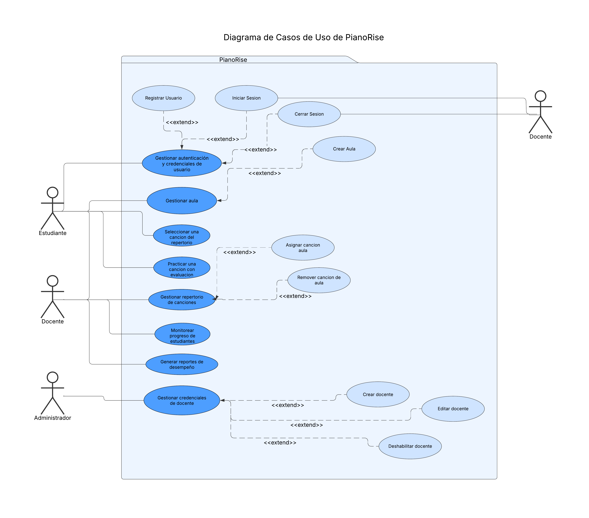  

  **Diagrama 01:** Diagrama de paquetes de PianoRise. 
  **Fuente:** Elaboración propia.

## 2.2. Vista Lógica

### Diagrama de Componentes:
Este diagrama proporciona una vista más detallada de los componentes del proyecto PianoRise, facilitando la comprensión de su estructura y organización.

  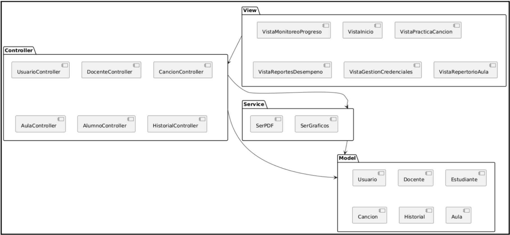  

  **Diagrama 02:** Diagrama de Componentes de PianoRise. 
  **Fuente:** Elaboración propia.

## 2.3. Vista del Proceso

 #### Diagrama Secuencia {#diagrama-secuencia}

      
Diagrama de secuencia CU - 01: Gestionar Autentiación y Credenciales de Usuario
      
  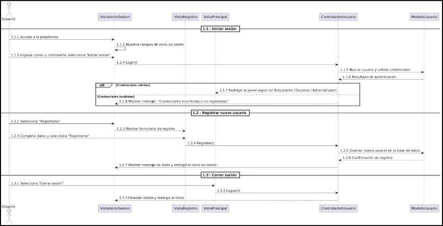

  **Diagrama 03:**  Diagrama de secuencia del caso de uso 01.
       
  **Fuente:** Elaboración propia.
  

  

      
  Diagrama de secuencia CU - 02: Gestionar Autentiación y Credenciales de Usuario
      
  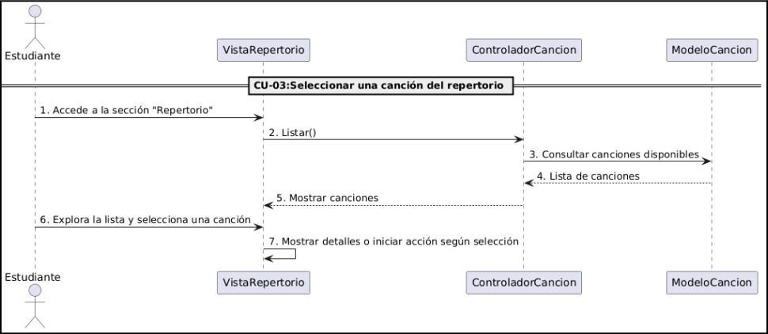

  **Diagrama 04:**  Diagrama de secuencia del caso de uso 02.
       
  **Fuente:** Elaboración propia.
      

  

      
  Diagrama de secuencia CU - 03: Gestionar Autentiación y Credenciales de Usuario
      
  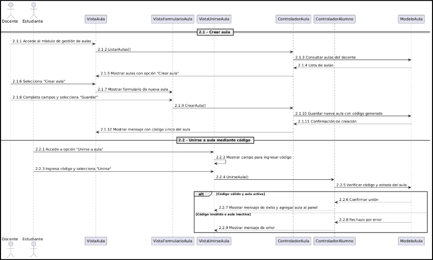

  **Diagrama 05:**  Diagrama de secuencia del caso de uso 03.
       
  **Fuente:** Elaboración propia.
      

  

      
  Diagrama de secuencia CU - 04: Gestionar Autentiación y Credenciales de Usuario
      
  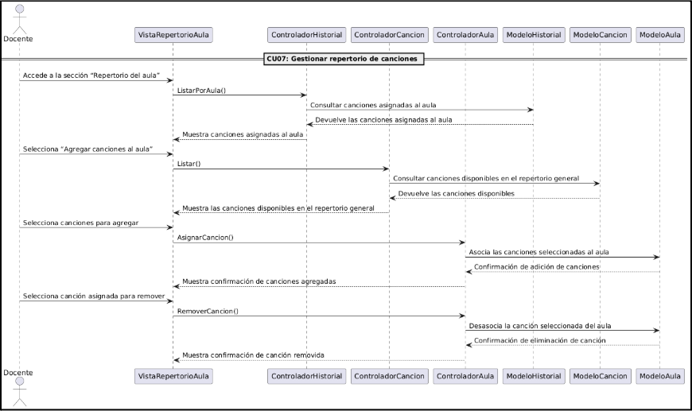

  **Diagrama 06:**  Diagrama de secuencia del caso de uso 04.
       
  **Fuente:** Elaboración propia.
  

  

      
  Diagrama de secuencia CU - 05: Gestionar Autentiación y Credenciales de Usuario
      
  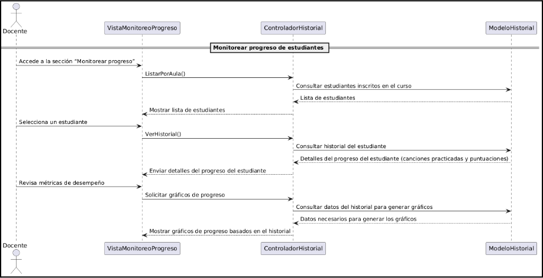

  **Diagrama 07:**  Diagrama de secuencia del caso de uso 05.
       
  **Fuente:** Elaboración propia.
      

  

      
  Diagrama de secuencia CU - 06: Gestionar Autentiación y Credenciales de Usuario
      
  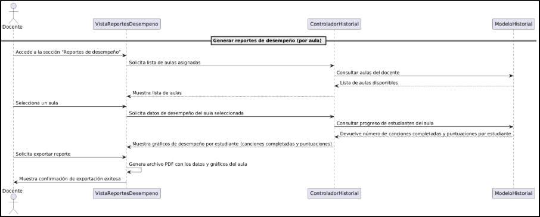

  **Diagrama 08:**  Diagrama de secuencia del caso de uso 06.
       
  **Fuente:** Elaboración propia.
      

  

      
  Diagrama de secuencia CU - 07: Gestionar Autentiación y Credenciales de Usuario
      
  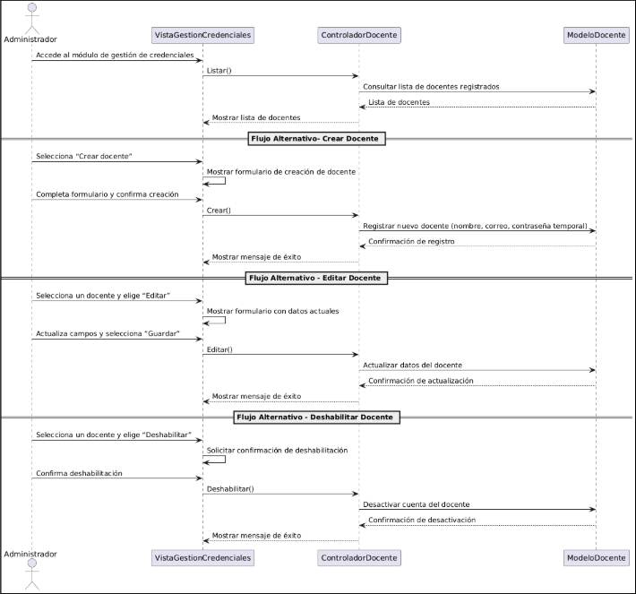

  **Diagrama 09:**  Diagrama de secuencia del caso de uso 07.
       
  **Fuente:** Elaboración propia.
      

## 2.4. Vista de desarrollo
### Diagrama de paquetes
Muestra la estructura de directorios del proyecto "PianoRise". Dentro de la carpeta principal, se encuentran varios directorios organizados por funcionalidades.

 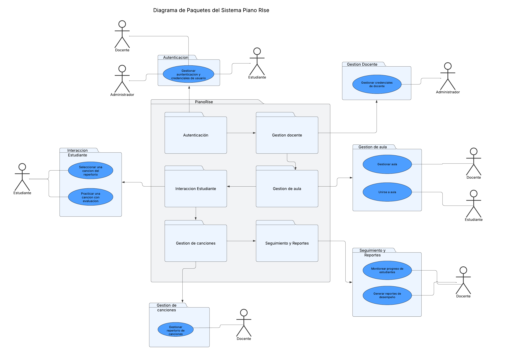

**Diagrama 10:**  Diagrama de paquetes de PianoRise.
       
**Fuente:** Elaboración propia.

## 2.5. Vista Física
### Diagrama de clases:
El diagrama muestra la interacción entre alumnos y docentes, cada uno con usuario, a su vez se ve la interacción entre aulas, canciones y el historial.

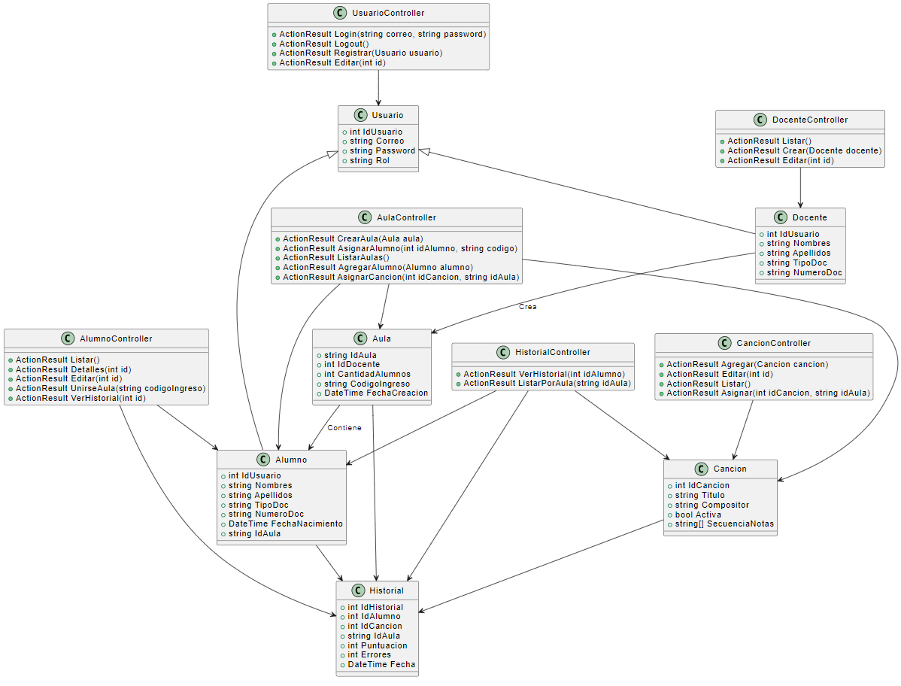

**Diagrama 11:**   Diagrama de clases de PianoRise.
       
**Fuente:** Elaboración propia.

## 3. Objetivos y Limitaciones Arquitectónicas

### 3.1. Disponibilidad

- **Alta Disponibilidad**: Se implementarán mecanismos de redundancia y recuperación ante fallos para garantizar que la plataforma esté accesible en todo momento, especialmente durante horarios escolares o de práctica frecuente.

- **Monitoreo y Alertas**: Se utilizarán herramientas de monitoreo en tiempo real para detectar interrupciones, errores en el sistema o problemas de conectividad, permitiendo una respuesta oportuna.

- **Escalabilidad Vertical y Horizontal**: La arquitectura permitirá escalar verticalmente (aumentando los recursos de los servidores existentes) y horizontalmente (añadiendo más servidores) a medida que crezca el número de usuarios o aulas activas.

### 3.2. Seguridad

- **Autenticación y Autorización**: PianoRise contará con un sistema robusto de autenticación basado en usuario y contraseña, diferenciando los accesos entre docentes y alumnos para preservar la integridad del contenido y los datos.

- **Encriptación de Datos**: Todos los datos sensibles, incluyendo credenciales y registros de desempeño, estarán encriptados tanto en tránsito como en reposo para proteger la privacidad del usuario.

- **Cumplimiento Normativo**: El sistema buscará alinearse con las normativas educativas y de protección de datos vigentes en el entorno de uso, especialmente en contextos escolares.

### 3.3. Adaptabilidad

- **Arquitectura Modular**: PianoRise estará diseñado con una arquitectura modular que facilite la incorporación de nuevas funcionalidades, como soporte para nuevos instrumentos musicales o algoritmos de análisis de sonido más avanzados.

- **Soporte Multiplataforma**: La plataforma será compatible con diversos dispositivos (computadoras, tablets) y navegadores web modernos, para asegurar una experiencia fluida tanto en el aula como en el hogar.

- **Configurabilidad**: Los docentes podrán personalizar aspectos clave del aula como la selección de repertorio, nivel de dificultad y fechas de práctica, sin necesidad de modificar el código fuente.

### 3.4. Rendimiento

- **Optimización de consultas**: Se optimizarán las consultas a la base de datos, especialmente aquellas relacionadas con la carga de aulas, historial de estudiantes y reproducción de resultados de prácticas.

- **Caching**: Se utilizarán mecanismos de caching inteligente para minimizar la latencia en la carga de información estática como canciones del repertorio general o historial de prácticas.

## 4. Análisis de Requerimientos

### 4.1. Requerimientos funcionales

| Código  | Requerimiento                         | Descripción                                                                                                                                                                                                                           | Prioridad |
|---------|---------------------------------------|---------------------------------------------------------------------------------------------------------------------------------------------------------------------------------------------------------------------------------------|-----------|
| RF-01   | Gestionar autenticación y credenciales del usuario | Permitir a los usuarios registrarse en el sistema proporcionando sus credenciales de acceso. Además, el sistema debe permitir que los usuarios puedan iniciar sesión utilizando dichas credenciales y cerrar sesión de forma segura. | Alta      |
| RF-02   | Almacenar progreso                    | Guardar el progreso de los estudiantes únicamente cuando completen satisfactoriamente una canción. El sistema registrará la canción como completada y almacenará la cantidad de errores cometidos durante su ejecución.              | Alta      |
| RF-03   | Reconocer notas musicales             | Capturar y procesar el audio del usuario a través del micrófono en tiempo real, identificando las notas tocadas y comparándolas con las esperadas en cada ejercicio.                                                                 | Alta      |
| RF-04   | Seleccionar canciones de un repertorio | Permitir que los estudiantes elijan canciones disponibles en el repertorio personalizado de su aula para practicarlas dentro del sistema.                                                                                             | Media     |
| RF-05   | Gestionar repertorio de canciones     | Permitir que los administradores agreguen, editen o deshabiliten canciones del repertorio disponible general antes y después de la configuración del aula.                                                                           | Media     |
| RF-06   | Monitorear progreso de estudiantes    | Permitir que los docentes visualicen el estado de las canciones completadas y no completadas por cada estudiante, junto con la puntuación obtenida en cada canción.                                                                  | Alta      |
| RF-07   | Generar reportes de desempeño         | Generar un reporte que muestre diferentes métricas y gráficos del desempeño de un aula.                                                                                                                                              | Media     |
| RF-08   | Gestionar Aulas                       | Permitir que los docentes creen aulas dentro del sistema para organizar a sus estudiantes. Dentro deberá seleccionar las canciones desde el repositorio general que serán asignadas al aula. El sistema generará un código de ingreso automáticamente, el cual será utilizado por los estudiantes para unirse a dicha aula. | Alta      |
| RF-09   | Gestionar Docentes                    | Permitir al administrador del sistema registrar nuevos docentes creando sus credenciales de acceso, definiendo su nombre, apellido, correo y contraseña. Además, podrá editar y deshabilitar docentes.                               | Alta      |

### 4.2. Requerimientos no funcionales

| Código   | Requerimiento                  | Descripción                                                                                                                                                                                                                   |
|----------|--------------------------------|-------------------------------------------------------------------------------------------------------------------------------------------------------------------------------------------------------------------------------|
| RNF-01   | Garantizar disponibilidad del sistema | El sistema debe garantizar una disponibilidad mínima del 97%, asegurando su correcto funcionamiento para el aprendizaje interactivo del piano. Esta disponibilidad considera mantenimientos programados, actualizaciones y posibles interrupciones imprevistas. |
| RNF-02   | Seguridad en la plataforma     | PianoRise debe proteger la información de los usuarios mediante mecanismos de autenticación y control de acceso. Se deben realizar pruebas de seguridad, incluyendo análisis de vulnerabilidades y pruebas de penetración.  |
| RNF-03   | Escalabilidad del sistema      | El sistema debe ser capaz de manejar un aumento en el número de usuarios sin afectar el rendimiento. Se prioriza una arquitectura optimizada para procesamiento en tiempo real de audio y reconocimiento de notas musicales sin latencias significativas. |
| RNF-04   | Usabilidad de la plataforma    | El sistema debe ofrecer una interfaz intuitiva y accesible, especialmente diseñada para principiantes en el piano.                                                                                                           |

## 5. Vista Lógica

### 5.1. Diagrama Contextual
Este diagrama contextual muestra las interacciones entre los dos módulos del sistema PianoRise: PianoRise.MVC, encargado de la gestión académica, y PianoRise.Flask, centrado en la práctica musical. Representa cómo los actores externos interactúan con cada módulo, y cómo ambos acceden a una base de datos compartida. Además, el módulo MVC se comunica con un servicio externo de correo electrónico para el envío de notificaciones.

  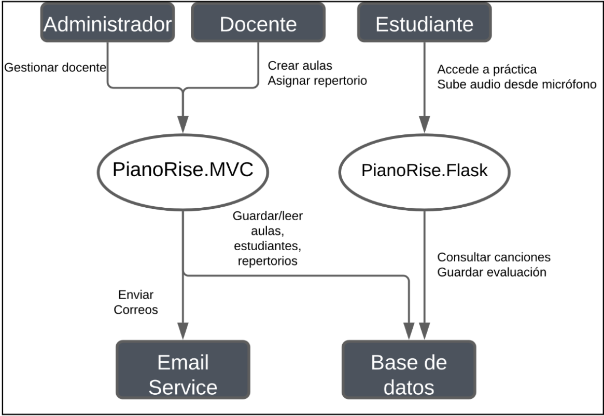  

  **Diagrama 12:**  Diagrama contextual de PianoRise. 
  **Fuente:** Elaboración propia.

## 6. Vista de Procesos
### 6.1. Diagrama de Proceso Actual
"El sistema actual no cuenta con un flujo definido. PianoRise viene a estructurar este proceso."

### 6.2. Diagrama de Proceso Propuesto

  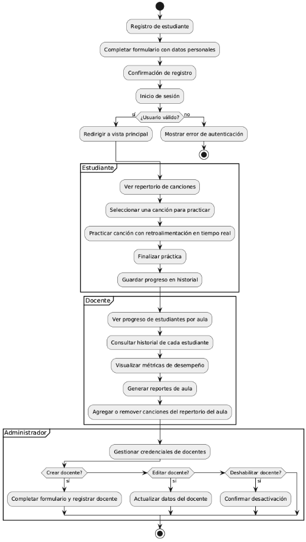    

  **Diagrama 13:**  El diagrama representa el flujo de PianoRise. 
  **Fuente:** Elaboración propia.

## 7. Vista de Despliegue
### 7.1. Diagrama de Contenedor 
Este diagrama de contenedor muestra la arquitectura de un sistema donde un dispositivo con un navegador se conecta a través de routers e internet a un servidor que hospeda las capas de presentación, datos y negocio de la aplicación.

  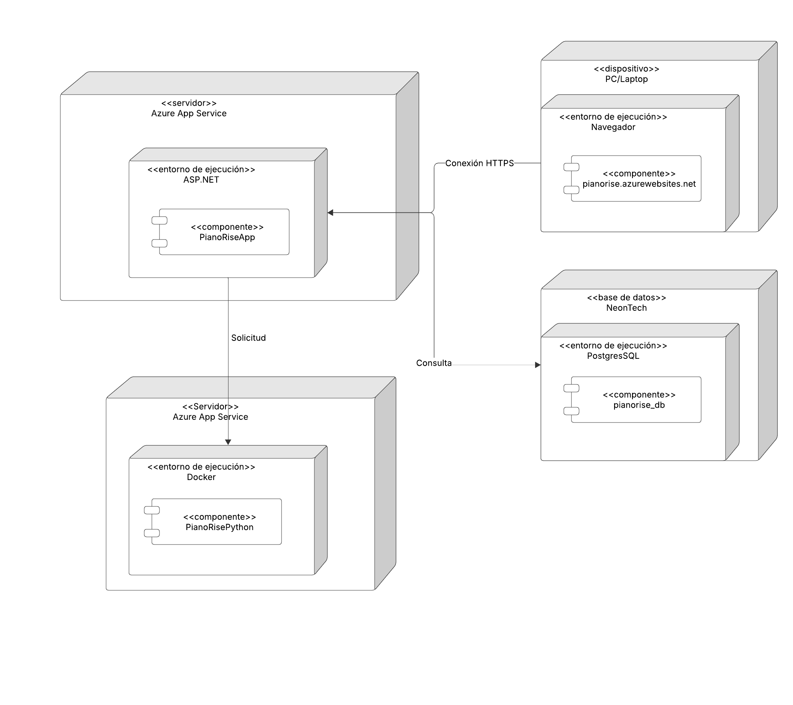    

  **Diagrama 14:**  Diagrama de contenedor de PianoRise. 
  **Fuente:** Elaboración propia.

## 8. Vista de Implementación
### 8.1. Diagrama de Componentes 
  Este diagrama proporciona una vista más detallada de los componentes del proyecto PianoRise, facilitando la comprensión de su estructura y organización.

      

  **Diagrama 15:**  Diagrama de componentes de PianoRise. 
  **Fuente:** Elaboración propia.

## 9. Vista de Datos
### 9.1. Diagrama Entidad Relación 
  El diagrama entidad-relación representa la estructura de la base de datos del sistema PianoRise, diseñado para el aprendizaje autodidacta del piano. El modelo incluye entidades como usuario, que gestiona la información personal y se relaciona con rol para definir permisos; aula, asociada a un docente y que agrupa a estudiantes mediante la relación alumno_aula; y cancion, que almacena piezas musicales asignadas a aulas a través de aula_cancion. Además, la entidad historial registra el desempeño del estudiante en cada canción, incluyendo precisión, errores y duración. Este diseño permite organizar aulas, gestionar contenido musical y monitorear el progreso de los alumnos.

  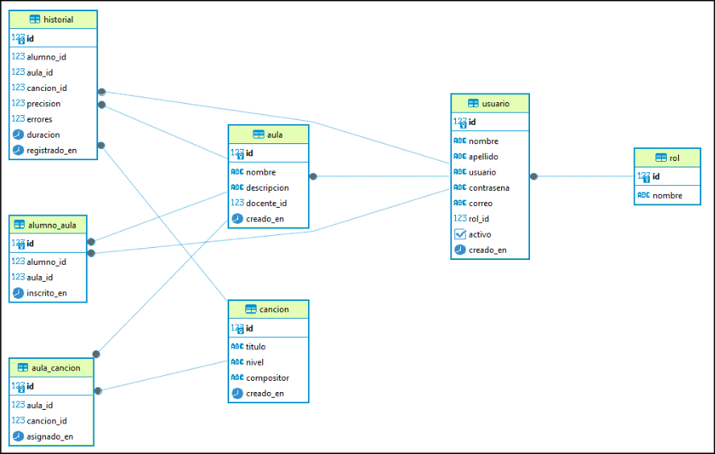    

  **Diagrama 16:**  Diagrama entidad relación de PianoRise. 
  **Fuente:** Elaboración propia.

## 10. Calidad
### 10.1. Escenario de Seguridad

  Las acciones dentro del sistema están restringidas según el tipo de usuario: docente, alumno o administrador. Para proteger la información académica y de desempeño, se aplican medidas como autenticación segura, validación de datos, cifrado de información sensible, principios de mínimo privilegio, control de sesiones y auditoría de eventos. Se utilizan prácticas seguras en las consultas a base de datos (parámetros parametrizados), así como firewalls y herramientas automáticas de detección de amenazas.

  - Fuente: Usuario
  - Estímulo: Realizar una acción en el sistema
  - Entorno: Todo el sistema
  - Artefacto: Autenticación del usuario
  - Respuesta: El sistema verifica la identidad y el rol del usuario antes de permitir cualquier acción
  - Medida de la Respuesta: El acceso se concede solo si el rol del usuario lo permite, asegurando integridad y confidencialidad en la base de datos

### 10.1. Escenario de Usabilidad

  <strong>Aprendizaje:</strong> 
  Al ingresar a la plataforma, el usuario (docente, admin u alumno) puede visualizar claramente las funcionalidades principales como acceso al aula, historial de prácticas, y configuración de perfil.
  
  <strong>Eficiencia:</strong> 
  El docente puede crear una nueva aula seleccionando canciones desde el repertorio general y asignando alumnos en pocos pasos, de forma intuitiva y rápida.

  <strong>Memoria:</strong> 
  El sistema mantiene visibles las configuraciones seleccionadas (como canciones, nivel de dificultad o fechas) durante el proceso de creación del aula para evitar pérdidas de información.

  <strong>Errores:</strong> 
  La plataforma valida datos en tiempo real, indicando campos incompletos o valores inválidos para prevenir errores comunes durante registros o asignaciones.

  <strong>Satisfacción:</strong> 
  El sistema confirma cada acción con mensajes claros y oportunos. La fluidez en el uso, el diseño intuitivo y la carga rápida contribuyen a una experiencia de usuario positiva.

### 10.1. Escenario de Adaptabilidad

  PianoRise está diseñado para operar correctamente en los principales sistemas operativos, adaptándose a diferentes resoluciones de pantalla y navegadores. Su arquitectura modular y diseño responsivo garantizan que tanto alumnos como docentes puedan acceder y trabajar desde diferentes dispositivos sin inconvenientes.

  - Fuente: Acceso a la plataforma web
  - Estímulo: Interfaz disponible
  - Entorno: Windows, Android, macOS, Linux
  - Artefacto: Ordenador de escritorio o laptop
  - Respuesta: Acceso completo sin errores
  - Medida de la Respuesta: El acceso debe lograrse en el menor tiempo posible

### 10.1. Escenario de Disponibilidad

  <strong>Disponibilidad Continua:</strong> 
  La plataforma estará disponible el 97% para todos los roles, con especial atención en horarios escolares donde se espera mayor tráfico.
  
  <strong>Recuperación Rápida ante Fallos:</strong> 
  En caso de errores de servidor o pérdida de conexión, el sistema contará con mecanismos automáticos de recuperación y respaldos periódicos para evitar pérdidas de datos y reducir tiempos de inactividad.

### 10.1. Otro Escenario

  <strong>Escenario de Confidencialidad</strong> 
  Solo el administrador del sistema tiene acceso a configuraciones globales y datos críticos como historiales académicos completos, estadísticas de uso o reportes de aula. Si un usuario no autorizado intenta acceder a estos datos, el sistema lo redirige automáticamente y registra el intento.

  - Afecta: Usuario
  - Validación del Escenario: Asegurar que solo administradores accedan a configuraciones sensibles
  - Origen: Usuario no autorizado
  - Estímulo: Intentar acceder a la información
  - Entorno: Condiciones normales
  - Artefacto: Sistema
  - Respuesta: La información está protegida y no se permite el acceso
  - Medida de la Respuesta: Rechazo inmediato del intento de acceso