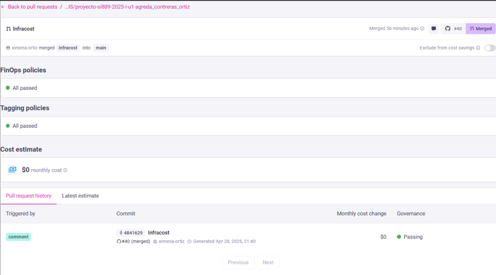
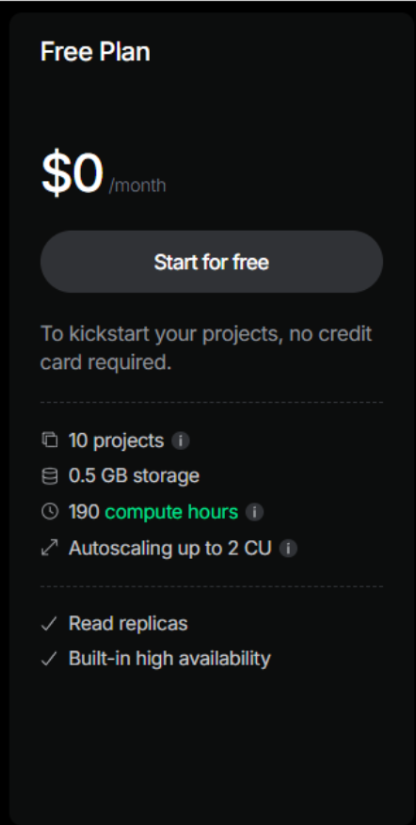
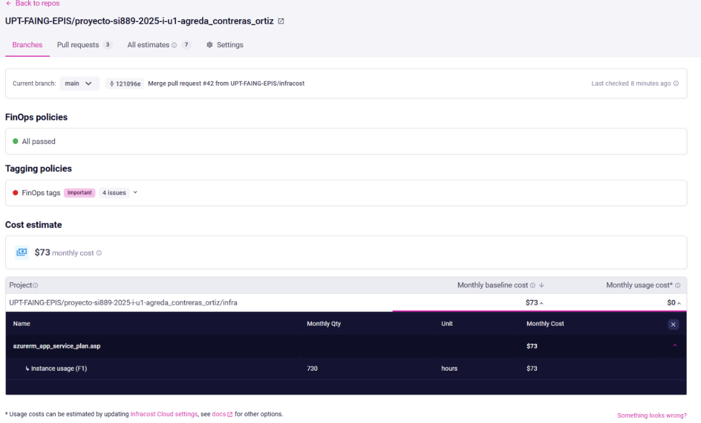

# UNIVERSIDAD PRIVADA DE TACNA

## FACULTAD DE INGENIERÍA

### Escuela Profesional de Ingeniería de Sistemas

**Plataforma Web Interactiva para el Aprendizaje Autónomo del Piano con Reconocimiento de Notas Musicales - PianoRise**

**Curso:** Patrones de Software  
**Docente:** Mag. Patrick Cuadros Quiroga  

**Integrantes:**  
- Agreda Ramirez, Jesús Eduardo (2021069823)  
- Ortiz Fernandez, Ximena Andrea (2021071080)  
- Contreras Lipa, Alvaro Javier (2021070020)  

**Tacna – Perú**  
**2025**  

---

# Plataforma Web Interactiva para el Aprendizaje Autónomo del Piano con Reconocimiento de Notas Musicales - PianoRise  
## Propuesta de Proyecto  
### Versión 2.0  

---

## CONTROL DE VERSIONES  

| Versión | Hecha por | Revisada por | Aprobada por | Fecha | Motivo |
|---------|-----------|--------------|--------------|-------|--------|
| 1.0 | Agreda Ramirez, Jesús Eduardo Contreras Lipa, Alvaro Javier Ortiz Fernandez, Ximena Andrea | Agreda Ramirez, Jesús Eduardo Contreras Lipa, Alvaro Javier Ortiz Fernandez, Ximena Andrea | 01/07/2025 | Correcciones Unidad III |

---

## Tabla de contenido  
1. Planteamiento del Problema  
2. Justificación del proyecto  
3. Objetivo general  
4. Beneficios  
5. Alcance  
6. Requerimientos del sistema  
   - Cuadro de Requerimientos Funcionales Final  
   - Cuadro de Requerimientos No Funcionales  
7. Restricciones  
8. Supuestos  
9. Resultados esperados  
10. Metodología de implementación  
11. Actores claves  
12. Papel y responsabilidades del personal  
13. Cronograma del proyecto  
14. Hitos de entregables  
15. Presupuesto  
16. Análisis de Factibilidad  
17. Evaluación Financiera  

---

## Resumen Ejecutivo  
**Nombre del Proyecto propuesto:**  
Plataforma Web Interactiva para el Aprendizaje Autónomo del Piano con Reconocimiento de Notas Musicales - PianoRise  

**Propósito del Proyecto y Resultados esperados:**  
PianoRise tiene como propósito principal transformar la enseñanza del piano en entornos escolares mediante una plataforma web interactiva. Esta solución permite a los estudiantes practicar de manera autónoma con retroalimentación en tiempo real, y a los docentes gestionar aulas, monitorear el avance y generar reportes de desempeño.  

Los objetivos específicos que sustentan este propósito son los siguientes:  
- Facilitar el aprendizaje autodidacta del piano: Mediante ejercicios interactivos y retroalimentación basada en reconocimiento de audio.  
- Optimizar el seguimiento académico musical: Permitiendo a los docentes monitorear avances individuales, puntuaciones y errores mediante reportes automáticos.  
- Modernizar la educación artística: Digitalizando procesos como la asignación de repertorio y evaluación del desempeño sin requerir infraestructura especializada.  
- Fortalecer el rol del docente: Brindando herramientas tecnológicas para la gestión de aulas, seguimiento de estudiantes y toma de decisiones pedagógicas.  
- Promover una educación inclusiva y accesible: Con una plataforma que funciona desde cualquier navegador moderno, sin necesidad de software o hardware adicional.  

**Población Objetivo:**  
- Usuarios Finales: Estudiantes escolares y docentes de música.  
- Beneficiarios: Instituciones educativas como la I.E.P. Verdad y Vida – Veritas et Vita, docentes, estudiantes y padres de familia.  

**Monto de Inversión (En Soles):**  
S/ 33,960.00  

**Duración del Proyecto (En Meses):**  
4 meses  

*Tabla 01. Tabla de resumen ejecutivo de la plataforma web PianoRise.*  
*Fuente: Elaboración propia.*  

---

## Propuesta narrativa  
PianoRise es una plataforma web educativa diseñada para transformar el aprendizaje del piano en estudiantes de nivel escolar mediante el uso de tecnologías interactivas. La aplicación tiene como finalidad facilitar una experiencia de aprendizaje autónoma, guiada y altamente personalizada, que combine práctica musical con retroalimentación inmediata, supervisión docente y herramientas de seguimiento académico.  

El sistema integra un conjunto de funcionalidades que permiten a los docentes gestionar aulas virtuales, asignar repertorios personalizados y monitorear el avance de sus estudiantes a través de reportes detallados. Al mismo tiempo, ofrece a los estudiantes un entorno motivador donde pueden practicar piezas musicales directamente desde el navegador web, utilizando el micrófono de su dispositivo para recibir retroalimentación precisa sobre su ejecución.  

Como característica diferenciadora, PianoRise incorpora tecnologías de reconocimiento de audio para detectar y analizar las notas musicales interpretadas por los estudiantes, comparándolas con una partitura esperada. Esta capacidad permite evaluar la precisión, registrar errores cometidos y validar el progreso de forma objetiva, almacenando únicamente las canciones completadas satisfactoriamente.  

Además, la plataforma genera indicadores visuales y reportes automáticos, lo cual fortalece la toma de decisiones pedagógicas y permite un seguimiento individualizado del desempeño estudiantil. Estas funcionalidades se implementan mediante un diseño arquitectónico modular, utilizando herramientas modernas como Python (Librosa), ASP.NET MVC y PostgreSQL, lo que garantiza escalabilidad, rendimiento y adaptabilidad al entorno educativo.  

En conjunto, PianoRise representa una solución innovadora y estratégica para la educación musical escolar, que moderniza los métodos tradicionales de enseñanza del piano, fomenta el aprendizaje interactivo y posiciona a las instituciones educativas que lo adopten como pioneras en la integración de tecnologías educativas aplicadas al arte.  

---

## Planteamiento del Problema  
En la actualidad, la enseñanza del piano en contextos escolares enfrenta múltiples desafíos que limitan tanto el aprendizaje efectivo de los estudiantes como la capacidad de los docentes para realizar un seguimiento estructurado del progreso académico. Estos desafíos incluyen la falta de herramientas tecnológicas específicas para la práctica musical individualizada, la escasa retroalimentación inmediata durante el proceso de aprendizaje, la dificultad para monitorear el avance de manera objetiva y la carencia de mecanismos de evaluación automatizada. Además, la inexistencia de un sistema que integre reconocimiento musical con funciones pedagógicas dificulta la modernización de la enseñanza artística.  

**Falta de una plataforma especializada para la enseñanza musical con retroalimentación automatizada:**  
Los métodos tradicionales de enseñanza dependen exclusivamente de la observación directa del docente, lo que limita el seguimiento continuo, especialmente en contextos con alta carga académica o múltiples estudiantes. No existen herramientas tecnológicas integradas que permitan practicar el piano con validación automatizada y brindar recomendaciones específicas sobre la ejecución musical.  

**Seguimiento impreciso y desorganizado del progreso estudiantil:**  
Actualmente, los docentes no disponen de métricas claras ni sistemas centralizados que les permitan registrar qué canciones han sido practicadas correctamente, qué errores se repiten o qué tan rápido progresa cada estudiante. Esto afecta la personalización del aprendizaje y dificulta la toma de decisiones pedagógicas.  

**Ausencia de reportes académicos generados automáticamente:**  
La falta de reportes visuales y estadísticas impide evaluar el rendimiento de los estudiantes de forma objetiva y comparable. La elaboración manual de informes consume tiempo y puede generar inconsistencias o falta de seguimiento en el largo plazo.  

**Interacción poco motivadora para los estudiantes:**  
Los entornos de aprendizaje musical actuales carecen de elementos interactivos como retroalimentación visual, alertas auditivas o gamificación, lo que puede afectar la motivación y el compromiso del estudiante durante la práctica autónoma del instrumento.  

**Limitaciones en la gestión académica musical:**  
No existen mecanismos que permitan a los docentes estructurar aulas virtuales, asignar repertorios personalizados o gestionar múltiples estudiantes desde un solo entorno. Esto dificulta la organización académica y limita la escalabilidad del proceso educativo. 

## Justificación del proyecto  
La implementación de la Plataforma Web PianoRise busca responder a las limitaciones actuales en la enseñanza musical escolar, específicamente en el aprendizaje del piano, mediante los siguientes aportes clave:  

**Aprendizaje musical personalizado mediante reconocimiento de notas:**  
PianoRise utiliza tecnologías de procesamiento de audio y reconocimiento de notas musicales para evaluar la ejecución del estudiante en tiempo real. Esto permite una retroalimentación objetiva, precisa y personalizada, superando las limitaciones de los métodos tradicionales basados únicamente en la observación del docente.  

**Gestión académica estructurada y centralizada:**  
La plataforma proporciona a los docentes herramientas para gestionar aulas virtuales, asignar repertorios por nivel y monitorear el avance individual de cada estudiante desde una interfaz web intuitiva. Esto optimiza el control académico y facilita el trabajo pedagógico en contextos con múltiples estudiantes.  

**Automatización de la evaluación y generación de reportes:**  
PianoRise automatiza el registro del progreso musical, genera estadísticas y reportes de desempeño en formato gráfico y PDF, reduciendo la carga manual del docente y mejorando la trazabilidad del aprendizaje.  

**Decisiones pedagógicas basadas en datos:**  
El sistema proporciona indicadores clave sobre la precisión, errores recurrentes, nivel de cumplimiento y frecuencia de práctica, lo que permite a los docentes identificar fortalezas y debilidades del alumno y adaptar su enfoque pedagógico en consecuencia.  

**Impulso a la innovación educativa y accesibilidad:**  
Diseñada para funcionar en navegadores modernos sin requerir software adicional, la plataforma permite una adopción sencilla incluso en instituciones con recursos limitados. Esto promueve la democratización del acceso a tecnologías educativas y posiciona a las instituciones que la implementan como líderes en innovación pedagógica.  

De esta manera, el proyecto PianoRise no solo moderniza el proceso de enseñanza musical, sino que también fortalece el rol del docente, motiva al estudiante y posiciona a las instituciones educativas como agentes activos en la transformación digital del aprendizaje artístico.  

---

## Objetivo general  
Desarrollar una plataforma web interactiva para mejorar el aprendizaje del piano en estudiantes de nivel escolar, mediante el uso de reconocimiento de notas musicales en tiempo real y funcionalidades pedagógicas estructuradas que permitan la práctica autónoma, el seguimiento personalizado y la gestión académica eficiente por parte de los docentes.  

---

## Beneficios  
**Beneficios tangibles:**  
- Reducción de costos en materiales impresos, al digitalizar los ejercicios, registros de progreso y evaluaciones musicales.  
- Disminución del tiempo de evaluación académica, gracias al reconocimiento automático de notas y generación de reportes.  
- Ahorro de recursos docentes, al automatizar parte del seguimiento y evaluación del desempeño estudiantil.  
- Optimización del uso de infraestructura tecnológica existente, al operar desde navegadores sin requerir dispositivos adicionales.  
- Mejora en el rendimiento estudiantil, al ofrecer práctica autónoma guiada y retroalimentación inmediata, reduciendo la necesidad de sesiones correctivas adicionales.  
- Facilidad de implementación en diversas instituciones educativas, sin requerimientos complejos de hardware o software.  

**Beneficios intangibles:**  
- Modernización de la enseñanza artística, posicionando a la institución como pionera en la aplicación de tecnologías educativas.  
- Incremento en la motivación y compromiso de los estudiantes, al interactuar con un entorno dinámico y visualmente atractivo.  
- Mayor satisfacción del cuerpo docente, al contar con herramientas para seguimiento, gestión de aulas y evaluación automatizada.  
- Mejora de la imagen institucional, al integrar soluciones tecnológicas que fortalecen el aprendizaje.  
- Fortalecimiento del perfil pedagógico de la institución, alineado con estándares de calidad e innovación educativa.  
- Facilitación del cumplimiento de indicadores educativos, relacionados con el uso de TIC y mejora del aprendizaje musical.  
- Mayor trazabilidad y toma de decisiones basada en datos, mediante reportes que reflejan el progreso y desempeño del alumnado.  

---

## Alcance  
**Inclusiones:**  
- Desarrollo de una Plataforma Web:  
  - Creación de una interfaz web intuitiva, accesible y eficiente para estudiantes y docentes de instituciones educativas de nivel escolar.  
  - Implementación de un sistema de autenticación y registro con roles diferenciados: estudiantes, docentes y administrador.  
  - Accesibilidad desde navegadores modernos (Chrome, Firefox, Edge) sin necesidad de instalación de software adicional.  

**Funcionalidades Clave:**  
- Gestión de usuarios: Registro y autenticación segura para docentes y estudiantes. El administrador podrá gestionar cuentas docentes.  
- Gestión de aulas virtuales: Los docentes pueden crear aulas, asignar repertorios personalizados y generar códigos únicos de acceso para estudiantes.  
- Reconocimiento de notas musicales: Captura de audio desde el micrófono del estudiante para detectar las notas tocadas y compararlas con las esperadas en la partitura.  
- Repertorio musical administrado: El administrador define un repertorio general de canciones; los docentes seleccionan piezas para cada aula; los estudiantes practican únicamente las asignadas.  
- Retroalimentación interactiva: Indicadores visuales y auditivos que muestran notas correctas e incorrectas durante la ejecución.  
- Registro y almacenamiento del progreso: Solo se registran las canciones completadas correctamente, junto con la cantidad de errores cometidos.  
- Monitoreo del avance estudiantil: Los docentes pueden visualizar el desempeño individual de cada alumno, incluyendo canciones completadas, errores y puntajes.  
- Generación de reportes de desempeño: Se generan reportes gráficos descargables con métricas clave por aula o estudiante, en formato PDF.  
- Soporte Tecnológico:  
  - Integración de bibliotecas de procesamiento de audio como Librosa mediante servicios en Python (Flask).  
  - Backend en ASP.NET MVC.  
  - Base de datos PostgreSQL.  
  - Despliegue en Azure con Docker y Terraform.  

**Exclusiones:**  
- Compatibilidad móvil: La plataforma estará diseñada exclusivamente para navegadores de escritorio. No se desarrollarán versiones móviles o aplicaciones nativas.  
- Instrumentos musicales distintos al piano: El sistema se enfocará únicamente en la enseñanza del piano.  
- Evaluación avanzada de teoría musical: No se incluirán funcionalidades como evaluación de lectura musical o análisis de tempo/ritmo complejo.  
- Integraciones externas: No se integrará con plataformas educativas externas ni con APIs de música comercial.  
- Interacción directa del estudiante con repertorios generales: Los estudiantes solo podrán acceder a las canciones asignadas por su docente, no al repertorio completo.  
- Capacitación docente dentro de la plataforma: No se ofrecerán módulos de formación para docentes en el uso pedagógico del sistema.  

---

## Requerimientos del sistema  

### Cuadro de Requerimientos Funcionales Final  

| Código | Requerimiento | Descripción | Prioridad |
|--------|--------------|-------------|-----------|
| RF-01 | Gestionar autenticación y credenciales del usuario | Permitir a los usuarios registrarse en el sistema proporcionando sus credenciales de acceso. Además, el sistema debe permitir que los usuarios puedan iniciar sesión utilizando dichas credenciales y cerrar sesión de forma segura. | Alta |
| RF-02 | Almacenar progreso | Guardar el progreso de los estudiantes únicamente cuando completen satisfactoriamente una canción. El sistema registrará la canción como completada y almacenará la cantidad de errores cometidos durante su ejecución. | Alta |
| RF-03 | Reconocer notas musicales | Capturar y procesar el audio del usuario a través del micrófono, identificando las notas tocadas y comparándolas con las esperadas en cada ejercicio. | Alta |
| RF-04 | Seleccionar canciones de un repertorio | Permitir que los estudiantes elijan canciones disponibles en el repertorio personalizado de su aula para practicarlas dentro del sistema. | Media |
| RF-05 | Gestionar repertorio de canciones | Permitir que los administradores agreguen, editen o deshabiliten canciones del repertorio disponible general antes y después de la configuración del aula. | Media |
| RF-06 | Monitorear progreso de estudiantes | Permitir que los docentes visualicen el estado de las canciones completadas y no completadas por cada estudiante, junto con la puntuación obtenida en cada canción. | Alta |
| RF-07 | Generar reportes de desempeño | Generar un reporte que muestre diferentes métricas y gráficos del desempeño de un aula. | Media |
| RF-08 | Gestionar Aulas | Permitir que el administrador cree aulas dentro del sistema y asigne a un docente responsable por cada una. Tanto el administrador como el docente podrán generar o actualizar el código de ingreso de 4 dígitos para el aula. Este código será utilizado por los estudiantes para unirse. El docente será responsable de editar los contenidos del aula, como el repertorio de canciones. | Alta |
| RF-09 | Gestionar Docentes | Permitir al administrador del sistema registrar nuevos docentes creando sus credenciales de acceso definiendo su nombre, apellido, correo y contraseña. Además, de poder editar y deshabilitar. | Alta |

*Tabla 02. Tabla de requerimientos funcionales de la plataforma web PianoRise.*  
*Fuente: Elaboración propia.*  

### Cuadro de Requerimientos No Funcionales  

| Código | Requerimiento | Descripción |
|--------|--------------|-------------|
| RNF-01 | Garantizar disponibilidad del sistema | El sistema debe garantizar una disponibilidad mínima del 97%, asegurando su correcto funcionamiento para el aprendizaje interactivo del piano. | 
| RNF-02 | Seguridad en la plataforma | PianoRise debe proteger la información de los usuarios mediante mecanismos de autenticación y control de acceso. | 
| RNF-03 | Escalabilidad del sistema | El sistema debe ser capaz de manejar un aumento en el número de usuarios sin afectar el rendimiento. Se prioriza una arquitectura optimizada para procesamiento de audio y reconocimiento de notas musicales sin latencias significativas. |
| RNF-04 | Usabilidad de la plataforma | El sistema debe ofrecer una interfaz intuitiva y accesible, especialmente diseñada para principiantes en el piano. |

*Tabla 03. Tabla de requerimientos no funcionales de la plataforma web PianoRise.*  
*Fuente: Elaboración propia.*  

---

## Restricciones  
- **Acceso restringido a perfiles según rol:** Solo los usuarios autenticados podrán acceder al sistema. Los estudiantes solo podrán interactuar con las funcionalidades de práctica y visualización de su progreso; no tendrán acceso a la configuración de aulas ni al repertorio general. La gestión de aulas y asignación de repertorios será exclusiva de los docentes.  
- **Asignación de repertorio exclusivamente docente:** Los estudiantes no podrán seleccionar libremente canciones fuera del repertorio asignado por su docente. Esta funcionalidad garantiza un avance pedagógico estructurado y supervisado.  
- **Dependencia de conectividad a Internet:** La plataforma funcionará únicamente en línea, por lo que todas sus funcionalidades —incluido el reconocimiento de notas musicales— requerirán una conexión estable a Internet.  
- **Disponibilidad tecnológica y compatibilidad:** El sistema dependerá de la disponibilidad de servicios en la nube (Azure) y tecnologías compatibles con ASP.NET MVC, Python (Flask), Docker y PostgreSQL. Cambios en estas tecnologías podrían requerir ajustes o migraciones.  
- **Requerimientos de hardware mínimo:** El sistema requiere dispositivos con navegador moderno y micrófono funcional para ejecutar correctamente el reconocimiento de notas musicales. Equipos sin estas capacidades no podrán utilizar plenamente la plataforma.  
- **Mantenimiento periódico del repertorio:** La administración de nuevas canciones y actualizaciones del repertorio será realizada exclusivamente por el administrador del sistema y no estará disponible para docentes ni estudiantes, limitando la frecuencia de cambios.  

---

## Supuestos  
- **Acceso a dispositivos adecuados por parte de los estudiantes:** Se asume que los estudiantes contarán con equipos compatibles con navegadores modernos y micrófono funcional para interactuar correctamente con la plataforma y utilizar el sistema de reconocimiento de notas musicales.  
- **Participación activa del cuerpo docente:** Se espera que los docentes estén dispuestos a adoptar la plataforma como herramienta complementaria a su enseñanza y gestionen activamente las aulas virtuales y repertorios asignados.  
- **Alineamiento institucional con la innovación pedagógica:** Se asume que la institución educativa tiene la disposición de implementar tecnologías digitales dentro de su plan curricular, en concordancia con los objetivos de modernización académica.  
- **Disponibilidad de infraestructura tecnológica estable:** El correcto funcionamiento de PianoRise depende de una infraestructura en la nube funcional (Azure) y conectividad constante para garantizar el acceso y operación de los servicios del sistema.  
- **Receptividad de los estudiantes al aprendizaje digital:** Se supone que los estudiantes están familiarizados con entornos digitales y dispuestos a interactuar con una herramienta web como parte de su formación artística.  

---

## Resultados esperados  
- **Automatización del seguimiento académico musical:**  
  Registro automático del avance de los estudiantes, incluyendo canciones completadas, errores cometidos y precisión de ejecución.  
- **Mejora en la eficiencia de evaluación docente:**  
  Reducción de la carga manual en la supervisión y calificación del progreso musical, gracias a reportes automáticos generados por el sistema.  
- **Disminución del tiempo requerido para monitorear el desempeño estudiantil:**  
  Los docentes podrán visualizar de forma rápida y estructurada el avance de cada estudiante, facilitando intervenciones pedagógicas oportunas.  
- **Fortalecimiento del proceso educativo y reputación institucional:**  
  La implementación de PianoRise posicionará a la institución como referente en innovación tecnológica aplicada a la enseñanza artística.  
- **Facilidad de uso para estudiantes y docentes:**  
  Interfaz intuitiva diseñada para un uso fluido por usuarios sin experiencia técnica avanzada, fomentando su adopción y continuidad de uso.  
- **Escalabilidad hacia otras áreas de educación musical:**  
  El sistema puede adaptarse en el futuro para incluir otros instrumentos o niveles educativos, extendiendo su impacto en la formación artística.  

---

## Metodología de implementación  
Para la implementación de la Plataforma Web Interactiva para el Aprendizaje Autónomo del Piano con Reconocimiento de Notas Musicales - PianoRise, se empleará la metodología Rational Unified Process (RUP), un enfoque iterativo y dirigido por casos de uso que permite una planificación estructurada, mitigación temprana de riesgos y entrega progresiva de funcionalidades.  

RUP se estructura en cuatro fases principales: Inicio, Elaboración, Construcción y Transición, cada una con objetivos, entregables y actividades clave. Esta metodología resulta adecuada para proyectos educativos con componentes tecnológicos avanzados como el reconocimiento de audio y la evaluación automatizada.  

### Fase de Inicio  
**Objetivo:** Definir el alcance del sistema, identificar a los actores principales (administrador, docentes y estudiantes) y establecer los requerimientos iniciales.  

**Actividades:**  
- Identificación de requerimientos funcionales y no funcionales (RF-01 al RF-09).  
- Elaboración del caso de negocio y análisis de viabilidad económica (VAN, TIR, B/C).  
- Modelado inicial del dominio: usuarios, aulas, canciones, progreso.  
- Definición del cronograma preliminar, asignación de tareas y estimación de recursos técnicos y humanos.  

### Fase de Elaboración  
**Objetivo:** Diseñar la arquitectura base del sistema, elegir tecnologías clave y mitigar riesgos técnicos, especialmente en el reconocimiento de notas musicales.  

**Actividades:**  
- Diseño de la arquitectura general bajo el patrón Modelo-Vista-Controlador (MVC) con ASP.NET.  
- Definición e integración del microservicio en Python (Flask) para el reconocimiento de notas musicales mediante análisis de audio.  
- Prototipado de interfaz de usuario con Tailwind CSS para asegurar una experiencia limpia y responsiva.  
- Modelado del flujo de datos, diseño de esquemas de base de datos en PostgreSQL.  
- Definición de endpoints para la comunicación entre el sistema principal y el módulo de procesamiento en Python.  

### Fase de Construcción  
**Objetivo:** Desarrollar todas las funcionalidades del sistema iterativamente, integrando tanto la interfaz como los módulos de lógica musical y académica.  

**Actividades:**  
- Desarrollo backend con ASP.NET MVC: autenticación (RF-01), gestión de aulas (RF-08), docentes (RF-09), repertorios (RF-05) y progreso (RF-02, RF-06).  
- Implementación del sistema de reconocimiento de notas musicales en Python (RF-03), usando bibliotecas especializadas de análisis de audio.  
- Desarrollo frontend con componentes personalizados para cada rol: administrador, docente y estudiante.  
- Pruebas unitarias y de integración por módulos.  
- Validación de funcionalidades clave con escenarios de práctica musical reales.  

### Fase de Transición  
**Objetivo:** Preparar el sistema para su puesta en marcha y validación con usuarios reales en un entorno controlado.  

**Actividades:**  
- Despliegue del sistema ASP.NET en Azure App Service y del microservicio Python contenerizado con Docker.  
- Entrenamiento a docentes y administradores sobre uso del sistema.  
- Pruebas de aceptación con estudiantes reales utilizando micrófono y canciones del repertorio.  
- Ajustes de usabilidad, rendimiento y corrección de errores detectados durante la prueba piloto.  
- Entrega de manuales técnicos y manuales de usuario.  

---

## Actores claves  
**Administrador:**  
- Tiene acceso total al sistema.  
- Registra y gestiona docentes (RF-09).  
- Administra el repertorio musical general (RF-05).  
- Crea aulas virtuales y asigna docentes responsables (RF-08).  
- Supervisa el sistema de seguimiento de progreso y generación de reportes (RF-06, RF-07).  

**Docente:**  
- Gestiona su aula: código de acceso, canciones disponibles, seguimiento de alumnos.  
- Puede visualizar el rendimiento y estadísticas de cada estudiante (RF-06).  
- Utiliza el sistema como herramienta de apoyo educativo, delegando la evaluación inicial al módulo de reconocimiento de notas.  

**Estudiante:**  
- Se registra en el sistema e ingresa a su aula mediante un código único.  
- Selecciona canciones del repertorio personalizado (RF-04).  
- Practica las piezas asignadas con su piano real mientras el sistema evalúa su ejecución en tiempo real (RF-03).  
- Visualiza su progreso, errores cometidos y canciones completadas (RF-02).  

---

## Papel y responsabilidades del personal  
**Administradores:**  
- Configuran el sistema, incluyendo aulas, docentes y repertorio.  
- Garantizan el correcto funcionamiento del backend y las integraciones.  
- Generan reportes académicos y métricas de uso para evaluación institucional.  

**Docentes:**  
- Usan la plataforma como apoyo para la enseñanza musical.  
- Ajustan el repertorio según el nivel de su aula.  
- Monitorean el avance de los estudiantes, brindando feedback personalizado.  

**Estudiantes:**  
- Acceden al sistema desde un navegador web.  
- Ejecutan prácticas musicales que son reconocidas por el sistema mediante micrófono.  
- Mejoran su aprendizaje a través de la retroalimentación automática y visualización de métricas.  

---

## Cronograma del proyecto  

| Fecha | Actividad / Módulo | Descripción |
|-------|--------------------|-------------|
| 30/04/2025 | Inicio del Proyecto | Inicio oficial del desarrollo del sistema PianoRise. |
| 30/04/2025 | Configuración del entorno de trabajo Python | Instalación de dependencias y herramientas necesarias (pyaudio, librosa, etc.). |
| 01/05/2025 | Desarrollo del Módulo de Captura de Audio | Captura en tiempo real del audio mediante micrófono. |
| 01/05/2025 | Implementación del Procesamiento de Frecuencias | Transformación del audio ha espectros de frecuencia y extracción de notas. |
| 02/05/2025 | Lógica de Comparación de Notas y Evaluación | Detección de notas correctas e incorrectas respecto a una melodía esperada. |
| 02/05/2025 | Desarrollo de Feedback Visual del Progreso | Indicadores visuales al tocar correctamente una nota (aciertos). |
| 03/05/2025 | Primera Entrega | Presentación del módulo en Python para reconocimiento de notas y visualización de aciertos. |
| 04/05 - 05/05 | Desarrollo del Módulo de Autenticación | Registro, inicio y cierre de sesión para administradores, docentes y alumnos. |
| 06/05 - 07/05 | Desarrollo del Módulo de Gestión de Aulas Virtuales | Creación, edición y configuración de aulas por parte de docentes. |
| 08/05 - 09/05 | Desarrollo del Módulo de Registro de Docentes | Registro, edición y deshabilitación de docentes por el administrador. |
| 10/05/2025 | Segunda Entrega | Funcionalidad básica: login, gestión de docentes y aulas lista. |
| 11/05 - 13/05 | Desarrollo del Módulo de Repertorio General | Administración de canciones base del sistema por parte del administrador. |
| 14/05 - 16/05 | Desarrollo del Módulo de Asignación de Canciones | Selección de canciones en el aula y asignación a estudiantes. |
| 17/05 - 20/05 | Desarrollo del Módulo de Registro del Progreso | Almacenamiento del historial de prácticas, errores y canciones completadas. |
| 21/05 - 23/05 | Desarrollo del Módulo de Monitoreo del Progreso | Visualización del avance por parte del docente. |
| 24/05 - 27/05 | Desarrollo del Módulo de Reportes de Desempeño | Generación de métricas, gráficas y exportación de informes en PDF. |
| 28/05 - 02/06 | Pruebas Unitarias e Integración | Validación funcional de los módulos implementados. |
| 03/06 - 17/06 | Optimización, Seguridad y Mejora UX/UI | Ajustes visuales, refactorización y validaciones de seguridad. |
| 18/06 - 25/06 | Pruebas de Usuario y Validación Final | Pruebas finales con feedback docente y estudiantil. |
| 28/06/2025 | Entrega Final (Versión 1.0) | Plataforma completa, funcional y validada. |

---

## Hitos de entregables  

| Fase | Entregable |
|------|-----------|
| Fase de Inicio | Informe de Factibilidad, Documento de Visión |
| Fase de Elaboración | Documento de Especificación de Requerimientos del Software, Documento de Arquitectura de Software |
| Fase de Desarrollo | Código Fuente, Informe Final del Proyecto |
| Fase de Transición | Informe de Propuesta de Proyecto |

*Tabla 05. Entregables de la aplicación web PianoRise.*  
*Fuente: Elaboración propia.*  

---

## Presupuesto  
Se definieron los siguientes costos:  

**Costos Generales:**  
"No se consideraron costos generales para el proyecto".  

**Costos operativos durante el desarrollo:**  
 
 
*Imagen 01. Imagen de los costos operativos realizada con Infracost para la plataforma PianoRise.*  
*Fuente: Elaboración propia.*  

 
 
*Imagen 02. Imagen de los costos operativos del hosting de la base de datos NeonTech para la plataforma PianoRise.*  
*Fuente: Elaboración propia.*  

**Costos del ambiente:** 
  
 

*Imagen 03. Imagen de los costos del ambiente realizada con Infracost para la plataforma PianoRise.*  
*Fuente: Elaboración propia.*  

 
 

*Imagen 04. Imagen de los costos del ambiente del hosting de la base de datos NeonTech para la plataforma PianoRise.*  
*Fuente: Elaboración propia.*  

**Costos de personal:**  

| Nombre del Rol | Cantidad de Personas | Horario de Trabajo |
|----------------|----------------------|--------------------|
| Desarrollador | 3 | 20 horas semanales aprox. |

*Tabla 01. Tabla de los roles y horas de trabajo del personal de desarrollo de la plataforma PianoRise.*  
*Fuente: Elaboración propia.*  

| Rol | Cantidad | Sueldo Mensual | Duración | Costo Total |
|-----|----------|----------------|----------|-------------|
| Desarrollador | 3 | 1130 | 4 meses | 13,560 |
| **Total** | | | | **13,560** |

*Tabla 02. Tabla de los costos de personal para el desarrollo de la plataforma PianoRise.*  
*Fuente: Elaboración propia.*  

**Costos totales del desarrollo del sistema:**  

| Categoría de Costo | Costo Total (S/.) |
|--------------------|------------------|
| Costos Generales | 0 |
| Costos Operativos | 0 |
| Costos del Ambiente (5 años) | 20,400 |
| Costos de Personal | 13,560 |
| **Total General del Proyecto** | **S/ 33,960** |

*Tabla 03. Tabla de los costos totales para el desarrollo de la plataforma PianoRise.*  
*Fuente: Elaboración propia.*  

---

## Análisis de Factibilidad  

### Factibilidad Técnica  
El estudio de factibilidad técnica tiene como finalidad evaluar los recursos tecnológicos actuales y su aplicabilidad en el desarrollo e implementación del sistema propuesto. En este caso, se analiza la infraestructura disponible, tanto de hardware como de software, así como su compatibilidad con los requerimientos del proyecto "PianoRise".  

**Hardware:**  
- **Servidores:**  
  - Host para el Servicio de Cursos de Música: Se utilizará Azure App Service en un plan de pago básico para desplegar el servicio desarrollado en ASP.NET. Este servicio en la nube garantiza la estabilidad, escalabilidad automática, administración simplificada y alta disponibilidad del sistema.  
  - Host para el Servicio de Reconocimiento de Notas: El módulo especializado en reconocimiento de notas musicales, desarrollado en Python, estará contenerizado en Docker y estará desplegado en Microsoft Azure App Service.  
- **Estaciones de trabajo:**  
  Se cuenta con computadoras personales para los desarrolladores con especificaciones estándar que incluyen procesadores Intel i5/i7, 8-16GB de RAM, y SSDs, que garantizan un entorno de desarrollo ágil y funcional.  

**Software:**  
- **Sistemas operativos:**  
  Desarrollo realizado en Windows, el cual es compatible con las herramientas seleccionadas.  
- **Aplicaciones y Herramientas de Desarrollo:**  
  - Visual Studio Code: Es uno de los entornos de desarrollo principales utilizados en el proyecto, compatible con los sistemas operativos Windows y macOS. Ofrece una gran variedad de extensiones que permiten personalizar el entorno de trabajo, facilitando la programación y la gestión de proyectos.  
  - Visual Studio 2022: También se emplea Visual Studio 2022 como entorno de desarrollo integral (IDE), especialmente para el desarrollo de aplicaciones ASP.NET MVC. Ofrece herramientas avanzadas para depuración, integración continua y desarrollo en la nube, optimizando así la productividad del equipo.  
  - Terraform: Utilizado para la creación y gestión automatizada de la infraestructura en Azure, asegurando consistencia, control de cambios y escalabilidad en los recursos desplegados.  
- **Lenguajes y frameworks:**  
  - Servicio de Cursos de Música: ASP.NET con .NET Framework utilizando el patrón Modelo-Vista-Controlador (MVC) y Tailwind CSS para la maquetación y diseño visual de las interfaces.  
  - Servicio de Reconocimiento de notas musicales: El procesamiento de audio será realizado de forma independiente usando Python con librerías especializadas.  

**Infraestructura de red y acceso a internet:**  
El sistema se desarrollará y desplegará completamente en línea. Se cuenta con acceso estable a internet para todas las fases del proyecto, y el alojamiento web asegurado con dominio personalizado.  

**Compatibilidad de navegadores:**  
El sistema será accesible desde navegadores modernos como Google Chrome, Mozilla Firefox, Microsoft Edge y Safari, sin necesidad de instalar software adicional.  

### Factibilidad Operativa  
La factibilidad operativa analiza si el sistema propuesto puede ser implementado, mantenido y utilizado de forma efectiva por la organización y los usuarios finales. En el caso de "PianoRise", el sistema brindará beneficios significativos en el proceso de enseñanza y evaluación de habilidades musicales.  

**Beneficios del Sistema:**  
- Automatización del proceso de creación y gestión de aulas virtuales.  
- Mejora en la eficiencia del seguimiento del progreso de los alumnos.  
- Disminución del tiempo requerido para evaluar el desempeño en ejercicios musicales.  
- Fortalecimiento de la relación entre docentes y alumnos a través de retroalimentación digital inmediata.  
- Facilidad de uso para docentes y alumnos mediante interfaces intuitivas.  
- Posibilidad de expansión hacia nuevos módulos como repertorios personalizados o torneos de práctica musical.  

**Capacidad Operativa:**  
- El sistema es autoadministrado por el personal docente de la Escuela de Música, con soporte técnico mínimo requerido.  
- Los usuarios (docentes y alumnos) reciben interfaces diferenciadas según su rol y necesidades específicas.  
- Se considera un uso liviano a moderado del sistema (baja concurrencia simultánea), por lo que no se requieren recursos tecnológicos de alta demanda.  
- La aplicación cuenta con paneles de control y módulos de práctica amigables, que no requieren entrenamiento técnico especializado para su operación.  

### Factibilidad Legal  
El sistema "PianoRise" cumple con las normativas legales y reglamentos nacionales relacionados con el uso de software educativo y protección de datos personales. No se detectan conflictos legales para su implementación.  

**Aspectos Legales Considerados:**  
- Protección de datos personales: El sistema almacenará información personal de egresados. Se cumplirán los principios de la Ley N.° 29733 (Ley de Protección de Datos Personales), asegurando confidencialidad, integridad y acceso controlado a la información.  
- Seguridad de la información: Se utilizarán protocolos de seguridad como HTTPS y cifrado de contraseñas.  
- Uso de software adecuado: El sistema se desarrollará en ASP.NET (.NET Framework) y Python (para el reconocimiento de notas), respetando licencias de uso de software privativo y de código abierto donde corresponda.  
- Contratos con terceros: Se respetarán los términos de servicio de servicios como Azure (alojamiento de Servicio de Reconocimiento de Notas y Servicio de Cursos de Música), NeonTech (alojamiento de la base de datos PostgreSQL).  

### Factibilidad Social  
El proyecto "PianoRise" tiene un impacto social positivo al fortalecer la formación musical y promover la innovación educativa mediante el uso de nuevas tecnologías.  

**Factores Sociales Relevantes:**  
- Apoyo institucional: La escuela y sus autoridades respaldan el proyecto como parte de su plan de modernización educativa.  
- Aceptación cultural: No existen barreras culturales o éticas, ya que el sistema mejora el acceso a métodos de enseñanza innovadores en el ámbito musical.  
- Inclusión digital: Permite que alumnos de distintos niveles accedan a prácticas musicales asistidas digitalmente, reduciendo brechas tecnológicas y educativas.  

### Factibilidad Ambiental  
El sistema "PianoRise" es una solución completamente digital, por lo que su impacto ambiental es mínimo.  

**Evaluación Ambiental:**  
- Reducción del uso de papel: Se digitalizan procesos de inscripción, práctica y evaluación de alumnos, contribuyendo a la sostenibilidad ecológica.  
- Alojamiento en la nube: El uso de servidores en la nube elimina la necesidad de infraestructura física local, reduciendo consumo energético adicional.  
- No se generan residuos: No se utilizan materiales contaminantes ni recursos físicos desechables en su operación.  

---

## Evaluación Financiera  

### Criterios de Inversión  

**Egresos Anuales:**  

| Año | Ambiente (Azure) | Personal (mantenimiento y soporte) | Total Egresos |
|-----|------------------|------------------------------------|--------------|
| 1 | 4,080 | 2,712 | 6,792 |
| 2 | 4,080 | 2,712 | 6,792 |
| 3 | 4,080 | 2,712 | 6,792 |
| 4 | 4,080 | 2,712 | 6,792 |
| 5 | 4,080 | 2,712 | 6,792 |
| **Total** | **20,400** | **13,560** | **33,960** |

*Tabla 07. Tabla de los egresos anuales de la UPT posterior al desarrollo de la plataforma PianoRise.*  
*Fuente: Elaboración propia.*  

**Ingresos Anuales:**  

| Año | Licencias (4 inst.) | Talleres (4) | Patrocinios | Total Ingresos |
|-----|---------------------|--------------|-------------|---------------|
| 1 | 8,000 | 2,000 | 1,000 | 11,000 |
| 2 | 8,000 | 2,000 | 1,000 | 11,000 |
| 3 | 8,000 | 2,000 | 1,000 | 11,000 |
| 4 | 8,000 | 2,000 | 1,000 | 11,000 |
| 5 | 8,000 | 2,000 | 1,000 | 11,000 |
| **Total** | **40,000** | **10,000** | **5,000** | **55,000** |

*Tabla 07. Tabla de los egresos anuales de la UPT posterior al desarrollo de la plataforma PianoRise.*  
*Fuente: Elaboración propia.*  

**Cuadro FNC:**  

| Año | Ingresos (S/.) | Egresos (S/.) | FNC (S/.) |
|-----|---------------|--------------|----------|
| 0 | 0 | 13,560 | -13,560 |
| 1 | 11,000 | 6,792 | 4,208 |
| 2 | 11,000 | 6,792 | 4,208 |
| 3 | 11,000 | 6,792 | 4,208 |
| 4 | 11,000 | 6,792 | 4,208 |
| 5 | 11,000 | 6,792 | 4,208 |

*Tabla 09. Tabla del flujo neto de caja del desarrollo y ciclo de vida de la aplicación web PianoRise.*  
*Fuente: Elaboración propia.*  

**Relación Beneficio/Costo (B/C):**  
B/C = 1.168  
Como B/C > 1, el proyecto es viable económicamente, ya que los beneficios superan a los costos.  

**Valor Actual Neto (VAN):**  
VAN = S/ 7,588.31  
Un VAN positivo indica que el proyecto genera valor adicional después de recuperar la inversión inicial.  

**Tasa Interna de Retorno (TIR):**  
TIR = 7.2%  
Como TIR > tasa de interés (1.5%), el proyecto es rentable y debe aceptarse, ya que supera el costo de oportunidad.  